# dlm-js — TypeScript Kalman filter/smoother with autodiff MLE

<strong>
  <a href="https://hamk-uas.github.io/dlm-js/">API Reference</a> |
  <a href="https://github.com/hamk-uas/dlm-js">GitHub</a> |
  <a href="https://mjlaine.github.io/dlm/">Original MATLAB DLM Docs</a> |
  <a href="https://github.com/mjlaine/dlm">Original MATLAB DLM GitHub</a>
</strong>

A TypeScript Kalman filter + RTS smoother library using [jax-js-nonconsuming](https://github.com/hamk-uas/jax-js-nonconsuming), inspired by [dynamic linear model](https://mjlaine.github.io/dlm/dlmtut.html) (MATLAB). Extends the original with autodiff-based MLE via `jit(valueAndGrad + Adam)` and an exact O(log N) parallel filter+smoother via `lax.associativeScan` (Särkkä & García-Fernández 2020).

🤖 AI generated code & documentation with gentle human supervision.

### Features at a glance
- **Kalman filter & RTS smoother**: Sequential (`scan`) and exact O(log N) parallel (`assoc`) algorithms.
- **Autodiff MLE**: Jointly estimate observation noise, process noise, and AR coefficients via `jit(valueAndGrad + Adam)`.
- **Multiple backends**: Runs on CPU, WASM (recommended for speed), and WebGPU.
- **Missing data & irregular timestamps**: Built-in support for NaN observations and arbitrary time steps.
- **Forecasting**: Propagate states $h$ steps ahead with calibrated uncertainty bounds.
- **Cross-platform**: Works in Node.js and the browser (ESM & CommonJS).

> ⚠️ **Warning:** The API is not yet frozen and may change before the 1.0 release.

## Installation

dlm-js is not yet published to npm. Install directly from GitHub:

```shell
# npm
npm install github:hamk-uas/dlm-js

# pnpm
pnpm add github:hamk-uas/dlm-js
```

This also installs the `@hamk-uas/jax-js-nonconsuming` dependency automatically.

## Usage

dlm-js works in **both Node.js and the browser** — the library has no platform-specific code. It ships ESM, CommonJS, and TypeScript declarations.

Naming convention: exported JS/TS APIs use camelCase (for example `dlmFit`, `dlmGenSys`), while original MATLAB functions are lowercase (for example `dlmfit`, `dlmsmo`, `dlmgensys`).

### ESM (Node.js / browser bundler)

```js
import { dlmFit, dlmGenSys } from "dlm-js";

// Nile river annual flow data (excerpt)
const y = [1120, 1160, 963, 1210, 1160, 1160, 813, 1230, 1370, 1140];

// Fit a local linear trend model (order=1, state dim m=2)
const result = await dlmFit(y, { obsStd: 120, processStd: [40, 10], order: 1, dtype: 'f64' });

console.log(result.yhat);       // smoothed predictions [n]
console.log(result.smoothed);   // smoothed states (StateMatrix: .series(i), .get(t,i))
console.log(result.deviance);   // -2·log-likelihood
// Also available: result.smoothedStd (StateMatrix), result.ystd [n], result.innovations [n],
//   result.standardizedResiduals [n], result.mse, result.mape, result.rss, result.residualVariance, result.nobs
```

For an order=1 model with `options.spline: true`, the W covariance is scaled to produce an integrated random walk (matches MATLAB `dlmfit` spline mode).

### CommonJS (Node.js)

```js
const { dlmFit } = require("dlm-js");
```

### Generate system matrices only

```js
import { dlmGenSys } from "dlm-js";

const sys = dlmGenSys({ order: 1, harmonics: 2, seasonLength: 12 });
console.log(sys.G);  // state transition matrix (m×m)
console.log(sys.F);  // observation vector (1×m)
console.log(sys.m);  // state dimension
```

### h-step-ahead forecasting

Propagate the last smoothed state h steps forward with no new observations:

```js
import { dlmFit, dlmForecast } from "dlm-js";

const y = [1120, 1160, 963, 1210, 1160, 1160, 813, 1230, 1370, 1140];

// Fit a local linear trend model
const fit = await dlmFit(y, { obsStd: 120, processStd: [40, 10], order: 1, dtype: 'f64' });

// Forecast 12 steps ahead
const fc = await dlmForecast(fit, 120, 12, { dtype: 'f64' });

console.log(fc.yhat);       // predicted observation means [h] = F·x_pred
console.log(fc.ystd);       // observation prediction std devs [h] — grows monotonically
console.log(fc.predicted);  // state trajectories (StateMatrix)
console.log(fc.h);          // 12
console.log(fc.m);          // 2 (state dimension)
```

`fc.yhat` is the full observation prediction `F·x_pred`. For pure trend models (no seasonality) this equals the level state and is appropriate to plot directly. For seasonal or AR models, `yhat` oscillates with the harmonics/AR dynamics in the forecast horizon — if you want a smooth trendline, use the level state `fc.predicted.series(0)` directly:

```js
// For seasonal/AR models: plot level state, not yhat
const trend = fc.predicted.series(0);           // smooth trend mean
const trendStd = fc.predictedStd.series(0);     // level state std dev
```

With covariates, pass `X_forecast` rows for each forecast step:

```js
// Forecast 3 steps ahead with known future covariate values
const fc = await dlmForecast(fit, 120, 3, { dtype: 'f64', X: [
  [solarProxy[n], qbo1[n], qbo2[n]],    // step n+1
  [solarProxy[n+1], qbo1[n+1], qbo2[n+1]], // step n+2
  [solarProxy[n+2], qbo1[n+2], qbo2[n+2]], // step n+3
] });
```

Current behavior for unknown future covariates: if `X_forecast` is omitted (or does not provide a row/entry), dlm-js uses `0` for the missing covariate value in that step. Interpret this as a **baseline conditional forecast** (unknown driver effects set to zero), not a full unconditional forecast.

For a more neutral assumption in practice, center covariates before fitting so that `0` represents a typical/historical-average driver level. Then the default forecast corresponds to “no expected driver anomaly.”

For decision use, prefer scenario forecasting: provide multiple plausible `X_forecast` paths (e.g. low/base/high) and compare resulting forecast bands.

### Missing data (NaN observations)

Place `NaN` in the observation vector `y` wherever a measurement is absent. `dlmFit` automatically skips those timesteps in the Kalman gain and residual calculations (K and v are zeroed), so the smoother interpolates through the gaps without any extra configuration:

```js
import { dlmFit } from "dlm-js";

// Nile data with a gap in years 30–39 and every 7th observation missing
const y = [1120, 1160, 963, NaN, 1210, 1160, 1160, NaN, 813, /* ... */];

const result = await dlmFit(y, { obsStd: 120, processStd: [40, 10], order: 1, dtype: 'f64' });

// nobs: number of non-NaN observations actually used
console.log(result.nobs);   // e.g. 77 when 23 of 100 values are NaN

// yhat, smoothed, smoothedStd, ystd: fully interpolated — finite at every timestep
console.log(result.yhat);                    // smoothed observation mean [n] — no NaN
console.log(result.smoothed);                // smoothed state trajectories (StateMatrix) — no NaN
console.log(result.smoothedStd);             // smoothed state std devs (StateMatrix) — no NaN
console.log(result.ystd);                    // smoothed observation std devs [n] — no NaN

// innovations and standardizedResiduals: NaN at missing positions (consistent with MATLAB dlmsmo)
console.log(result.innovations);             // innovations [n] — NaN at missing timesteps
console.log(result.standardizedResiduals);   // squared normalised residuals [n] — NaN at missing timesteps

// deviance is the log-likelihood summed only over observed timesteps
console.log(result.deviance);
```

Missing observations are handled identically to MATLAB's `dlmsmo` (`ig = not(isnan(y(i,:)))` logic): the filter propagates through the gap using only the prior, and the RTS smoother then distributes the information from surrounding observations backward and forward. `ystd` grows wider over the gap, reflecting higher uncertainty where no data was seen.

### Irregular timestamps

When observations are not uniformly spaced, pass a `timestamps` array to `dlmFit`. The transition matrix $G(\Delta t)$ and process noise covariance $W(\Delta t)$ are then computed per-step in closed form: $G$ via matrix-exponential discretization of the continuous-time state matrix; $W$ via analytic continuation of the discrete-time noise accumulation sum evaluated at non-integer $\Delta t$ (Faulhaber sums). No numerical ODE solver or matrix exponential of $W$ needed.

```js
import { dlmFit } from "dlm-js";

// Observations at irregular times (e.g. years with gaps)
const y   = [1120, 1160, 963, 1210, 1160,   969, 831, 456, 824, 702];
const ts  = [1871, 1872, 1873, 1874, 1875,  1910, 1911, 1913, 1914, 1915];
//                                        ↑ 35-year gap

const result = await dlmFit(y, {
  obsStd: 120, processStd: [40, 10], order: 1,
  timestamps: ts, dtype: 'f64',
});

console.log(result.yhat);      // smoothed predictions at each timestamp
console.log(result.ystd);      // observation std devs — wider after gaps
```

**Supported components:** polynomial trend (order 0, 1, 2) and trigonometric harmonics. `fullSeasonal` and AR components throw because they are purely discrete-time constructs with no natural continuous-time extension.

#### How it works

The standard DLM propagates through each unit timestep as $x_{t+1} = G \cdot x_t + w_t$ with $w_t \sim \mathcal{N}(0, W)$.  For a gap of $\Delta t$ steps between consecutive observations, `dlmGenSysTV` computes:

**Transition matrix** $G(\Delta t) = \text{expm}(F_c \cdot \Delta t)$ — for a polynomial trend this is just the Jordan block with entries $\Delta t^j / j!$ on the $j$-th superdiagonal:

$$G(\Delta t) = \begin{bmatrix} 1 & \Delta t & \Delta t^2/2 \\ 0 & 1 & \Delta t \\ 0 & 0 & 1 \end{bmatrix} \quad \text{(order 2)}$$

**Process noise** $W(\Delta t)$ is the accumulated discrete noise from $\Delta t$ unit steps:

$$W(\Delta t) = \sum_{k=0}^{\Delta t - 1} G^k \; W_1 \; (G^k)^\top$$

This is a discrete-time sum, not a continuous-time noise integral. Because $G$ is a Jordan block, $G^k$ has polynomial entries in $k$ and the sum reduces to closed-form Faulhaber sums. Evaluating those polynomials at non-integer $\Delta t$ is an **analytic continuation** of the discrete-time formula.  For order 1 with process noise std devs $w_0, w_1$:

$$W(\Delta t) = \begin{bmatrix} \Delta t \, w_0^2 + w_1^2 \, S_2 & w_1^2 \, S_1 \\ w_1^2 \, S_1 & \Delta t \, w_1^2 \end{bmatrix}$$

where $S_1 = \Delta t(\Delta t - 1)/2$ and $S_2 = \Delta t(\Delta t - 1)(2\Delta t - 1)/6$.  These formulas interpolate smoothly for non-integer $\Delta t$ and collapse to $W(1) = \text{diag}(w_0^2, w_1^2)$ at unit spacing.  The off-diagonal terms capture the physical coupling: slope noise accumulates into level variance over multi-step gaps.

**Trigonometric harmonics** scale the rotation angle: $\theta_k = \Delta t \cdot 2\pi h / n_s$, and process noise scales linearly: $W_{hh} = \Delta t \cdot w_h^2$.

**Indexing convention.** `G_scan[k]` encodes the *departing* transition from obs $k$ to obs $k+1$ ($\Delta t = T[k+1] - T[k]$).  The forward Kalman step applies $G_k$ *after* incorporating observation $k$ to predict the state at $k+1$.  In the associative scan path, element construction at position $k$ needs the *arriving* transition ($G_\text{scan}[k-1]$), which is built by shifting the array.

**Tip — interpolation at query points:** To obtain smoothed estimates at times where no measurement exists, insert `NaN` observations at those timestamps. The smoother treats NaN as a pure prediction step, giving interpolated state estimates and uncertainty bands at arbitrary query points.

**Related work.** [4] extends the parallel scan framework of [1] to continuous-time models, deriving exact associative elements for MAP trajectory estimation on irregularly-sampled data. dlm-js uses a simpler approach — closed-form $G$ discretization and analytic continuation of $W$ fed to the existing filter — but the parallel scan composition is directly applicable if continuous-time MAP estimation is needed in the future.

### MLE parameter estimation

Estimate observation noise `obsStd`, process noise `processStd`, and optionally AR coefficients by maximizing the Kalman filter log-likelihood via autodiff:

```js
import { dlmMLE } from "dlm-js";
import { defaultDevice } from "@hamk-uas/jax-js-nonconsuming";

defaultDevice("wasm"); // recommended: ~30× faster than "cpu"

const y = [1120, 1160, 963, 1210, 1160, 1160, 813, 1230, 1370, 1140 /* ... */];

// Basic: estimate obsStd and processStd
const mle = await dlmMLE(
  y,
  { order: 1, maxIter: 300, lr: 0.05, tol: 1e-6, dtype: 'f64' },
);

console.log(mle.obsStd);      // estimated observation noise std dev
console.log(mle.processStd);  // estimated process noise std devs
console.log(mle.deviance);    // -2·log-likelihood at optimum
console.log(mle.iterations);  // iterations to convergence
console.log(mle.elapsed);     // wall-clock ms
console.log(mle.fit);         // full DlmFitResult with optimized parameters

// With AR fitting: estimate obsStd, processStd, and AR coefficients jointly
const mleAR = await dlmMLE(
  y,
  { order: 0, arCoefficients: [0.5], fitAr: true, maxIter: 300, lr: 0.02, tol: 1e-6, dtype: 'f64' },
);
console.log(mleAR.arCoefficients);  // estimated AR coefficients (e.g. [0.81])
```

`dlmMLE` uses Adam with automatic differentiation (autodiff) to optimize the Kalman filter log-likelihood. The entire optimization step — forward filter + AD backward pass + Adam update — is compiled via `jit()` for speed. See [How MLE works](#how-mle-works) for technical details and [Parameter estimation: MATLAB DLM vs dlm-js](#parameter-estimation-maximum-likelihood-matlab-dlm-vs-dlm-js) for a detailed comparison.

`dlmMLE` also supports missing data — the Kalman loss scan zeros K, v, and the log-likelihood contribution at NaN timesteps, so autodiff and Adam optimization work correctly through the gaps:

```js
const mle = await dlmMLE(y, { order: 1, maxIter: 200, lr: 0.05 });
// mle.deviance is the log-likelihood summed only over observed timesteps
// mle.fit.nobs reports the count of non-NaN observations used
```

## Fit

### Demos

All demos can be regenerated locally with `pnpm run gen:svg`. The `assoc` and `webgpu` variants use an exact O(log N) parallel filter+smoother (Särkkä & García-Fernández 2020) and match the sequential `scan` results to within numerical tolerance (validated by `assocscan.test.ts`).

#### Nile River Flow (Local Linear Trend)

<p align="center">
  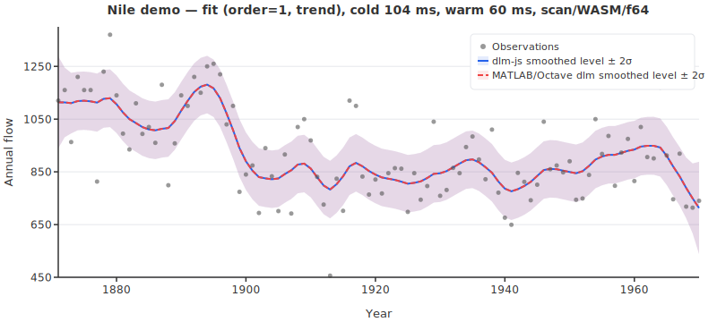
  <br/><br/>
  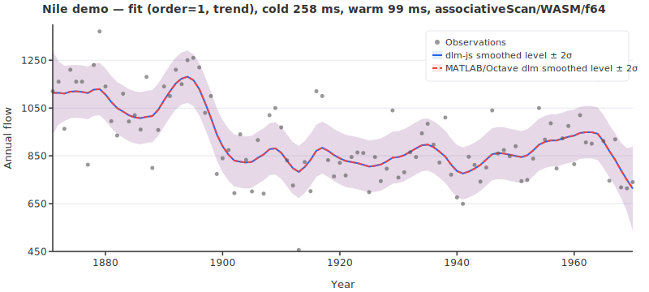
</p>

*First smoothed state (level) `smoothed[0]` from dlm-js (solid blue) vs MATLAB/Octave dlm (dashed red), with ± 2σ bands from `smoothedStd[:,0]` (state uncertainty, not observation prediction intervals).*

#### Kaisaniemi Monthly Temperatures (Seasonal)

<p align="center">
  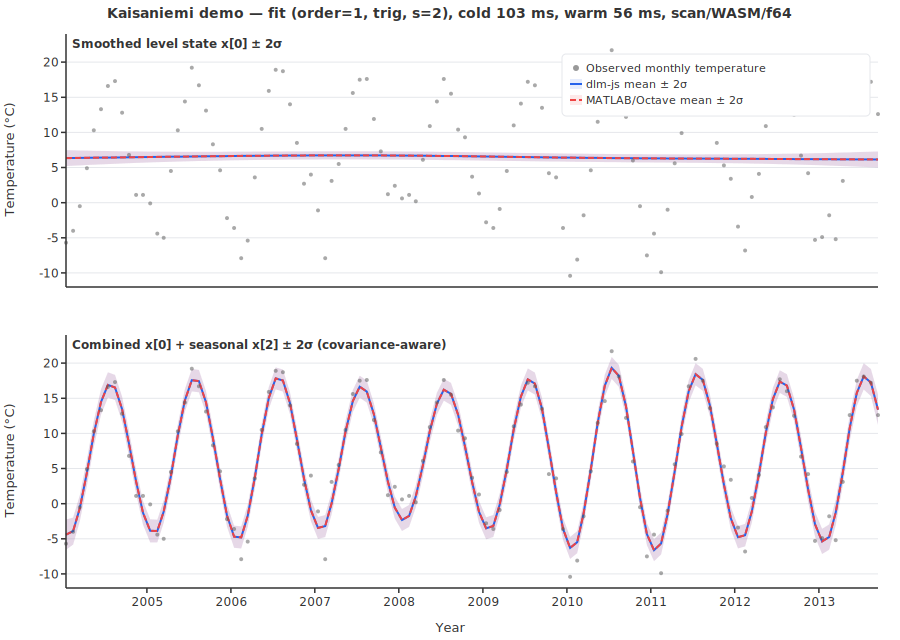
  <br/><br/>
  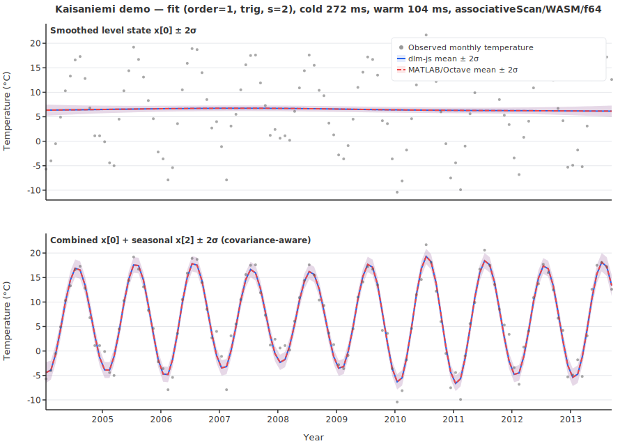
</p>

*Top panel: level state `smoothed[0] ± 2σ`. Bottom panel: covariance-aware combined signal `smoothed[0]+smoothed[2] ± 2σ`, using `Var(x0+x2)=Var(x0)+Var(x2)+2Cov(x0,x2)`. Model settings: `order=1`, `harmonics=1`, `obsStd=2`, `processStd=[0,0.005,0.4,0.4]`.*

#### Energy Demand (Seasonal + AR)

<p align="center">
  
  <br/><br/>
  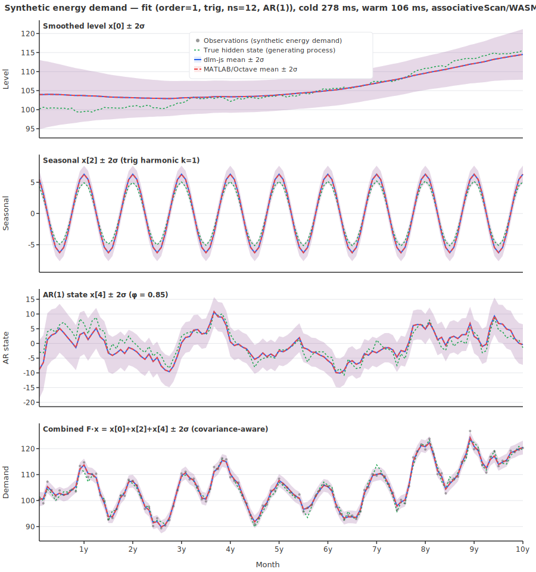
</p>

*Synthetic 10-year monthly data. Panels top to bottom: smoothed level `smoothed[0] ± 2σ`, trigonometric seasonal `smoothed[2] ± 2σ`, AR(1) state `smoothed[4] ± 2σ`, and covariance-aware combined signal `F·x = smoothed[0]+smoothed[2]+smoothed[4] ± 2σ`. True hidden states (green dashed) are overlaid. Model settings: `order=1`, `harmonics=1`, `seasonLength=12`, `arCoefficients=[0.85]`, `obsStd=1.5`, `processStd=[0.3,0.02,0.02,0.02,2.5]`, m=5.*

#### Stratospheric Ozone Trend Analysis

<p align="center">
  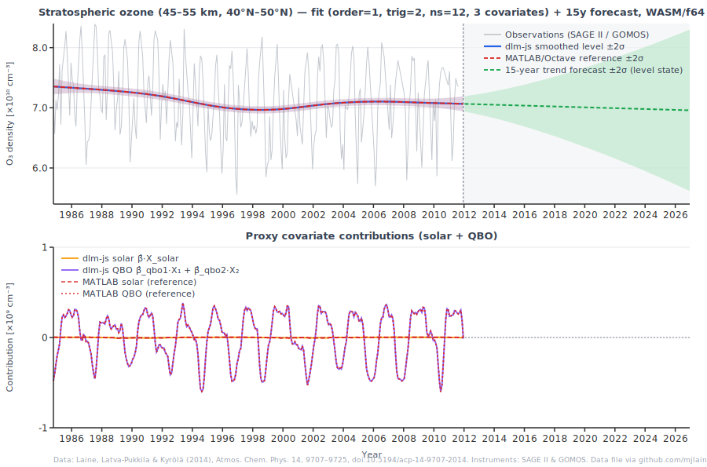
  <br/><br/>
  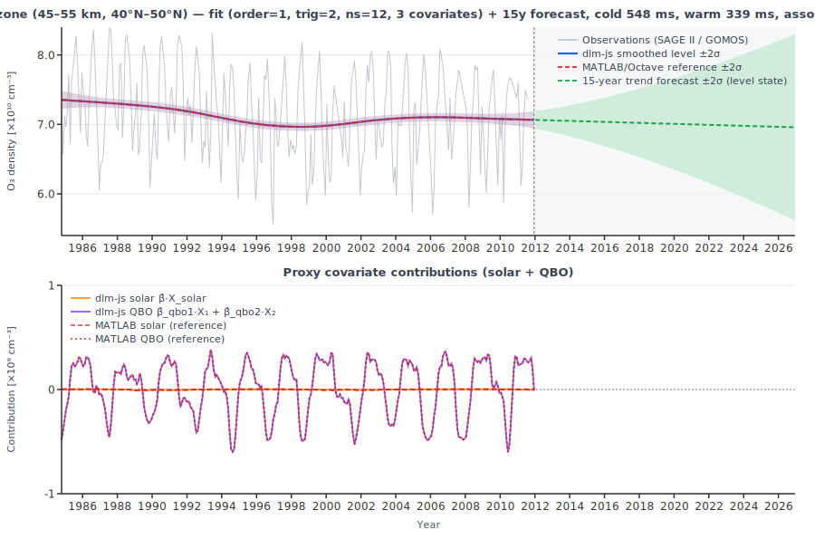
</p>

*Top panel: O₃ density (SAGE II / GOMOS observations, 1984–2011) with smoothed level state ± 2σ and a 15-year `dlmForecast` trend extrapolation. Bottom panel: proxy covariate contributions — solar cycle (β̂·X_solar, amber) and QBO (β̂_qbo1·X₁ + β̂_qbo2·X₂, purple). Model: `order=1`, `harmonics=2`, `seasonLength=12`, 3 static-β covariates, state dimension m=9.*

#### Missing Data (NaN observations)

<p align="center">
  
  <br/><br/>
  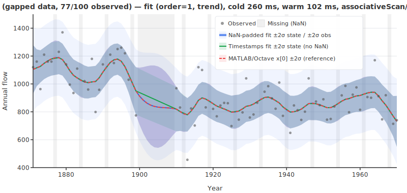
</p>

*Nile flow (n=100) with 23 NaN observations. Gray bands mark missing timesteps. Outer light band: observation prediction interval `F·x_smooth ± 2·ystd`; inner opaque band: state uncertainty `smoothed[0] ± 2·smoothedStd[0]`. The smoother interpolates continuously through all gaps with no extra configuration.*

### scan algorithm

`algorithm: 'scan'` uses sequential `lax.scan` for both the Kalman forward filter and RTS backward smoother. It is the default when `algorithm` is not set and the `assoc` path is not auto-selected.

The dominant error source is **not** summation accuracy — it is catastrophic cancellation in the RTS backward smoother step `C_smooth = C - C·N·C`. When the smoothing correction nearly equals the prior covariance, the subtraction amplifies any rounding in the operands. Kahan summation in jax-js-nonconsuming cannot fix this because it only improves the individual dot products, not the outer subtraction. See detailed comments in `src/index.ts`.

**Float32 stabilization (Joseph form):** When `dtype: 'f32'`, the scan path automatically uses Joseph-form stabilization, replacing the standard covariance update `C_filt = C_pred - K·F·C_pred` with:

$$C_{\text{filt}} = (I - K F) \, C_{\text{pred}} \, (I - K F)^\top + K \, V^2 \, K^\top$$

This is algebraically equivalent but numerically more stable — it guarantees a positive semi-definite result even with rounding. Combined with explicit symmetrization (`(C + C') / 2`), this prevents the covariance from going non-positive-definite for m ≤ 2. Without Joseph form, Float32 + scan is numerically unstable for m ≥ 4 (see ⚠️ entries in the benchmark table). Float32 is still skipped in tests for m > 2 even with Joseph form, due to accumulated rounding in the smoother.

**MATLAB DLM comparison:** The `dlmsmo.m` reference uses the standard covariance update formula (not Joseph form), combined with explicit `triu + triu'` symmetrization after each filter step (line 77) and `abs(diag(C))` diagonal correction on smoother output (line 114). The improved match seen in the benchmark between dlm-js+joseph/f64 and the Octave reference (9.38e-11 vs 3.78e-8 max |Δ| for f64 without joseph) is not a coincidence — both approaches enforce numerical stability in similar ways, pushing both implementations toward the same stable numerical attractor.

### assoc algorithm

`algorithm: 'assoc'` uses `lax.associativeScan` to evaluate the **exact O(log N) parallel Kalman filter + smoother** from Särkkä & García-Fernández (2020) [1], Lemmas 1–4. Pass `{ algorithm: 'assoc' }` in the options to use it on any backend and any dtype. The assoc path always applies its own numerically stable formulation.

Both passes dispatch ⌈log₂N⌉+1 kernel rounds (Kogge-Stone), giving O(log n) total depth. Results are numerically equivalent to `scan` to within floating-point reordering (validated by `assocscan.test.ts`).

- **Forward filter** (exact 5-tuple from [1, Lemmas 1–2]): Constructs per-timestep 5-tuple elements $(A_k, b_k, C_k, \eta_k, J_k)$ with exact Kalman gains per Lemma 1, composed via `lax.associativeScan` using Lemma 2 with regularized inverse and push-through identity. No approximation — produces the same filtered states as sequential `scan`, up to floating-point reordering.
- **Backward smoother** ([1], Lemmas 3–4; see also Theorem 2): Exact per-timestep smoother gains $E_k = C_{filt,k} G^\top (G C_{filt,k} G^\top + W)^{-1}$ per Lemma 3, computed from the forward-filtered covariances via batched `np.linalg.inv`. Smoother elements $(E_k, g_k, L_k)$ — dlm-js replaces the standard-form $L_k = P_k - E_k G P_k$ (Lemma 3) with a Joseph-form variant for numerical stability — composed via `lax.associativeScan(compose, elems, { reverse: true })` (suffix scan). No accuracy loss — the backward smoother is algebraically equivalent to sequential RTS.

Combined with a WebGPU backend, this provides two orthogonal dimensions of parallelism: across time steps (O(log n) depth via `associativeScan`) and within each step's matrix operations (GPU ALUs). The same technique is used in production by Pyro's `GaussianHMM` [2] and NumPyro's parallel HMM inference [3].

#### Design choices

| Aspect | Choice | Rationale |
|--------|--------|----------|
| Exact 5-tuple elements | Per-timestep $(A, b, C, \eta, J)$ from Lemma 1 | Each timestep has its own Kalman gain — exact, no approximation. |
| Regularized inverse in compose | $(I + C_i J_j + \epsilon I)^{-1}$ | Guards against near-singular matrices at degenerate (NaN/zero-J) compose steps. $\epsilon = 10^{-6}$ (Float32) or $10^{-12}$ (Float64). |
| Push-through identity | $N = I - J_j M C_i$ | Derives the second inverse from the first — only one `np.linalg.inv` call per compose step. |
| Float mask blending | $A = \text{mask} \cdot A_{\text{obs}} + (1 - \text{mask}) \cdot G$ | Avoids boolean-conditioned `np.where` which can create discontinuous gradients in some AD frameworks. Arithmetic blending is smooth and AD-safe. |
| Scan output disposal | Individual `scanned.*.dispose()` after `x_filt` and `C_filt` recovery | Safe because `np.add` produces new arrays — `x_filt` and `C_filt` are independent of the scan pytree. |

### Backend performance

`dlmFit` warm-run timings (jitted core, second of two sequential runs) and maximum errors vs. the Octave/MATLAB reference (worst case across all 5 models and all outputs: yhat, ystd, smoothed, smoothedStd) for each backend × dtype × algorithm × stabilization combination. `assoc + joseph` is an invalid combination (the assoc path auto-selects its own stabilization). Regenerate with `pnpm run bench:full`. **Bold rows** are the auto-selected default per backend × dtype.

Models: Nile order=0 (n=100, m=1) · Nile order=1 (n=100, m=2) · Kaisaniemi trig (n=117, m=4) · Energy trig+AR (n=120, m=5) · Gapped order=1 (n=100, m=2, 23 NaN). Benchmarked on: <!-- computed:static("machine") -->Intel(R) Core(TM) Ultra 5 125H, 62 GB RAM<!-- /computed --> · GPU: <!-- computed:static("gpu") -->GeForce RTX 4070 Ti SUPER (WebGPU adapter)<!-- /computed -->.

| backend | dtype | algorithm | stab | Nile o=0 | Nile o=1 | Kaisaniemi | Energy | Gapped | max \|Δ\| | max \|Δ\|% |
|---------|-------|-----------|------|----------|----------|------------|--------|---------|----------|------------|
| **cpu** | **f64** | **scan** | **—** | **166 ms** | **358 ms** | **435 ms** | **478 ms** | **356 ms** | **3.78e-8** | **1.62e-4** |
| | | scan | joseph | 191 ms | 389 ms | 481 ms | 528 ms | — | 9.38e-11 | 3.56e-9 |
| | | assoc | — | 74 ms | 201 ms | 853 ms | 1534 ms | 213 ms | 1.33e-8 | 2.17e-5 |
| | **f32** | **scan** | **joseph** | **184 ms** | **384 ms** | **484 ms** | **533 ms** | **392 ms** | **1.32e-2** | **0.17** |
| | | scan | — | 171 ms | 345 ms | 439 ms | 482 ms | — | ⚠️ 180 | ⚠️ 1.4e6 |
| | | assoc | — | 67 ms | 204 ms | 869 ms | 1552 ms | 214 ms | 1.28e-2 | 19.7 |
| **wasm** | **f64** | **scan** | **—** | **16 ms** | **20 ms** | **22 ms** | **23 ms** | **20 ms** | **3.78e-8** | **1.62e-4** |
| | | scan | joseph | 18 ms | 22 ms | 22 ms | 22 ms | — | 9.38e-11 | 3.56e-9 |
| | | assoc | — | 24 ms | 25 ms | 32 ms | 39 ms | 24 ms | 1.33e-8 | 2.17e-5 |
| | **f32** | **scan** | **joseph** | **17 ms** | **20 ms** | **24 ms** | **21 ms** | **22 ms** | **3.99e-2** | **1.37** |
| | | scan | — | 15 ms | 20 ms | 21 ms | 19 ms | — | ⚠️ 7000 | ⚠️ 2e6 |
| | | assoc | — | 23 ms | 24 ms | 33 ms | 36 ms | 23 ms | 1.21e-2 | 21.9 |
| **webgpu** | **f32** | **assoc** | **—** | **325 ms** | **353 ms** | **356 ms** | **372 ms** | **⚠️ NaN** | **⚠️ 92.2** | **⚠️ 62.8** |
| | | scan | — | 549 ms | 913 ms | 1011 ms | 1141 ms | ⚠️ NaN | ⚠️ 110 | ⚠️ 6.7e4 |
| | | scan | joseph | 712 ms | 888 ms | 1041 ms | 1169 ms | — | 2.49e-2 | 1.32 |

⚠️ = numerically unstable. f32 + scan without Joseph-form stabilization blows up for larger state dimensions (m ≥ 4). WebGPU additionally produces NaN outputs when the data contains missing (NaN) observations. Both columns show worst case across all 5 benchmark models and all output variables (yhat, ystd, smoothed, smoothedStd). `max |Δ|%` uses the Octave reference value as denominator; percentages >1% in the `assoc` rows come from small smoothedStd values (not from yhat/ystd).

**Key findings:**
- **WASM is ~10–20× faster than CPU** — the JS interpreter backend has significant overhead for small matrix operations.
- **`assoc` on CPU is faster for small m, slower for large m** — for m=1–2, the scan composition is cheap and reduces interpreter overhead; for m=4–5 the extra matrix operations dominate (~2× slower than `scan` on CPU).
- **`assoc` on WASM has no warm-run advantage over `scan`** — warm times are nearly identical (~20–40 ms) for all models; the first-run cost is ~5× higher due to extra JIT compilation paths, so prefer `scan` on WASM unless you need the parallel path explicitly.
- **Why does joseph/f64 match Octave ~3,000× better than f64 (no joseph)?** MATLAB DLM (`dlmsmo.m`) does not use Joseph form — it uses the standard update plus `triu + triu'` symmetrization and `abs(diag)` correction (see MATLAB DLM comparison above). Both approaches stabilize the numerical trajectory similarly, pushing both implementations toward the same stable attractor. The ~3,000× improvement is real (9.38e-11 vs 3.78e-8 max |Δ|).
- **`assoc + joseph` is handled automatically** — the assoc path always applies its own numerically stable formulation. Stabilization is auto-selected internally and not a user-facing option.
- **f32 + scan without joseph is dangerous for large models** — covariance catastrophically cancels for m ≥ 4; `joseph` form (or `assoc`) is required for float32 stability. The `assoc` path is stable with float32 even without joseph on non-gapped data, as shown by the reasonable 1.28e-2 max error vs the ⚠️ 7000 for f32+scan.
- **Joseph form overhead is negligible on WASM** — f32+joseph vs f64 (no joseph) differ by <5 ms across all models, well within JIT variance. The stabilization (auto-selected internally) is numerically important but not a performance concern.
- **WebGPU `assoc` is ~4× faster than WebGPU `scan`** for larger models (m=4–5) — sequential scan on WebGPU dispatches O(n) kernels (no GPU parallelism); `assoc` uses O(log n) dispatches (Kogge-Stone), cutting ms from ~1800 to ~450 for Energy.
- **WebGPU `scan` is the worst option** — 1800 ms warm for Energy (m=5) vs 29 ms on WASM; every filter step is a separate GPU dispatch with no cross-workgroup sync.
- **WASM stays flat up to N≈3200 (fixed overhead), then scales linearly** — asymptotic per-step cost ~1.1 µs/step, giving ~<!-- timing:scale:wasm-f64:n819200 -->867 ms<!-- /timing --> at N=819200. WebGPU/f32 `assoc` scales **sub-linearly**: a 1024× increase from N=100 to N=102400 doubles the runtime (<!-- timing:scale:webgpu-f32:n100 -->306 ms<!-- /timing --> → <!-- timing:scale:webgpu-f32:n102400 -->637 ms<!-- /timing -->), but growth steepens at larger N (~1.7× per doubling at N>100k), so no crossover was observed up to N=819200 (ratio still 2.3×).
- **WebGPU results may differ slightly** from sequential WASM/f64 due to Float32 precision and operation reordering in the parallel scan, not from any algorithmic approximation — both paths use exact per-timestep Kalman gains.

For background on the Nile and Kaisaniemi demos and the original model formulation, see [Marko Laine's DLM page](https://mjlaine.github.io/dlm/). The energy demand demo uses synthetic data generated for this project. The gapped-data demo uses the same Nile dataset with 23 observations removed.

#### WebGPU/f32/assoc vs WASM/f64/scan warm-run benchmark

`dlmFit` warm-run timings (jitted core, second of two runs):

| Model | $n$ | $m$ | wasm / f64 / scan | webgpu / f32 / assoc |
|-------|-----|-----|-------------------|--------------------------|
| Nile, order=0 | 100 | 1 | <!-- timing:bb:nile-o0:wasm-f64 -->22 ms<!-- /timing --> | <!-- timing:bb:nile-o0:webgpu-f32 -->301 ms<!-- /timing --> |
| Nile, order=1 | 100 | 2 | <!-- timing:bb:nile-o1:wasm-f64 -->21 ms<!-- /timing --> | <!-- timing:bb:nile-o1:webgpu-f32 -->299 ms<!-- /timing --> |
| Kaisaniemi, trig | 117 | 4 | <!-- timing:bb:kaisaniemi:wasm-f64 -->20 ms<!-- /timing --> | <!-- timing:bb:kaisaniemi:webgpu-f32 -->307 ms<!-- /timing --> |
| Energy, trig+AR | 120 | 5 | <!-- timing:bb:trigar:wasm-f64 -->19 ms<!-- /timing --> | <!-- timing:bb:trigar:webgpu-f32 -->300 ms<!-- /timing --> |

**WebGPU/f32/assoc vs WASM/f64/scan scaling: O(log n) vs O(n).**

A scaling benchmark (Nile order=1, m=2) measured `dlmFit` warm-run timings at exponentially increasing N (WASM: 2 warmup + 4 timed runs, median; WebGPU: same). WASM uses sequential `scan`; WebGPU uses `assoc` (both forward filter and backward smoother via `lax.associativeScan`):

| N | wasm/f64/scan | webgpu/f32/assoc | ratio |
|---|---------------|-----------------|-------|
| 100 | <!-- timing:scale:wasm-f64:n100 -->22 ms<!-- /timing --> | <!-- timing:scale:webgpu-f32:n100 -->306 ms<!-- /timing --> | 27× |
| 200 | <!-- timing:scale:wasm-f64:n200 -->21 ms<!-- /timing --> | <!-- timing:scale:webgpu-f32:n200 -->310 ms<!-- /timing --> | 29× |
| 400 | <!-- timing:scale:wasm-f64:n400 -->21 ms<!-- /timing --> | <!-- timing:scale:webgpu-f32:n400 -->349 ms<!-- /timing --> | 30× |
| 800 | <!-- timing:scale:wasm-f64:n800 -->20 ms<!-- /timing --> | <!-- timing:scale:webgpu-f32:n800 -->385 ms<!-- /timing --> | 30× |
| 1600 | <!-- timing:scale:wasm-f64:n1600 -->21 ms<!-- /timing --> | <!-- timing:scale:webgpu-f32:n1600 -->412 ms<!-- /timing --> | 31× |
| 3200 | <!-- timing:scale:wasm-f64:n3200 -->21 ms<!-- /timing --> | <!-- timing:scale:webgpu-f32:n3200 -->425 ms<!-- /timing --> | 36× |
| 6400 | <!-- timing:scale:wasm-f64:n6400 -->24 ms<!-- /timing --> | <!-- timing:scale:webgpu-f32:n6400 -->445 ms<!-- /timing --> | 33× |
| 12800 | <!-- timing:scale:wasm-f64:n12800 -->31 ms<!-- /timing --> | <!-- timing:scale:webgpu-f32:n12800 -->464 ms<!-- /timing --> | 27× |
| 25600 | <!-- timing:scale:wasm-f64:n25600 -->43 ms<!-- /timing --> | <!-- timing:scale:webgpu-f32:n25600 -->522 ms<!-- /timing --> | 19× |
| 51200 | <!-- timing:scale:wasm-f64:n51200 -->60 ms<!-- /timing --> | <!-- timing:scale:webgpu-f32:n51200 -->561 ms<!-- /timing --> | 13× |
| 102400 | <!-- timing:scale:wasm-f64:n102400 -->126 ms<!-- /timing --> | <!-- timing:scale:webgpu-f32:n102400 -->637 ms<!-- /timing --> | 7× |
| 204800 | <!-- timing:scale:wasm-f64:n204800 -->236 ms<!-- /timing --> | <!-- timing:scale:webgpu-f32:n204800 -->790 ms<!-- /timing --> | 3.4× |
| 409600 | <!-- timing:scale:wasm-f64:n409600 -->437 ms<!-- /timing --> | <!-- timing:scale:webgpu-f32:n409600 -->1150 ms<!-- /timing --> | 2.6× |
| 819200 | <!-- timing:scale:wasm-f64:n819200 -->867 ms<!-- /timing --> | <!-- timing:scale:webgpu-f32:n819200 -->2012 ms<!-- /timing --> | 2.3× |

Three findings:

1. **WASM stays flat up to N≈3200**, then grows roughly linearly (O(n)). The per-step cost asymptotes around ~1.4 µs/step at N=102400 (~<!-- timing:scale:wasm-f64:n102400 -->126 ms<!-- /timing --> total). The flat region reflects fixed JIT/dispatch overhead, not compute.

2. **WebGPU scales sub-linearly (O(log n))** — both forward and backward passes use `lax.associativeScan`, so each dispatches ⌈log₂N⌉+1 Kogge-Stone rounds. A 1024× increase from N=100 to N=102400 only doubles the runtime (<!-- timing:scale:webgpu-f32:n100 -->306 ms<!-- /timing --> → <!-- timing:scale:webgpu-f32:n102400 -->637 ms<!-- /timing -->). However, the fixed per-dispatch overhead of WebGPU command submission is high (~500 ms base), so the constant factor dominates at practical series lengths.

3. **The WASM-to-WebGPU ratio converges as N grows**: ~27× at N=100, ~7× at N=102400, ~2.3× at N=819200. WASM is faster at all measured N. However, WebGPU's per-doubling growth factor (~1.7×) is smaller than WASM's (~2.0×), so the gap continues to narrow. No crossover was observed up to N=819200; based on the measured trend (WebGPU scaling steeper than pure O(log n) at large N, likely due to memory allocation and GPU transfer overhead), a crossover would require N well above 1M on this hardware.


## MLE

### Demos

#### Nile MLE Optimization

<p align="center">
  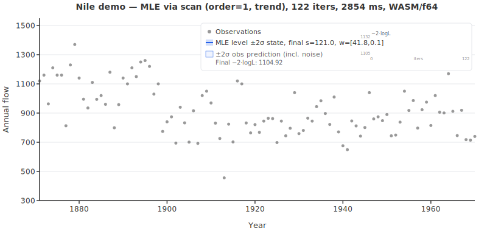
  <br/><br/>
  
  <br/><br/>
  
</p>

*Parameter estimation via autodiff (`dlmMLE`). Orange dashed = initial variance-based guess, blue solid = MLE optimum. The entire optimization step is wrapped in a single `jit()` call. Estimated observation noise s = 121.1 (known: 122.9), -2·log-likelihood = 1105.0. WebGPU is slower than WASM at n=100 due to dispatch overhead, but pays off at large N.*

#### Energy MLE Optimization (with AR estimation)

<p align="center">
  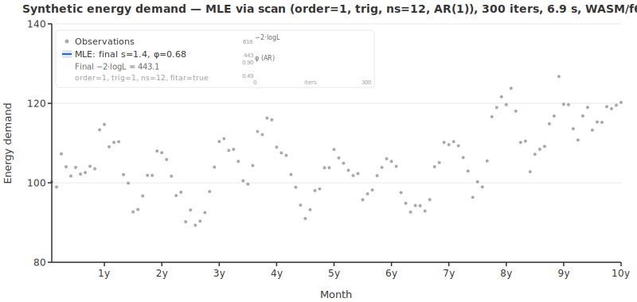
  <br/><br/>
  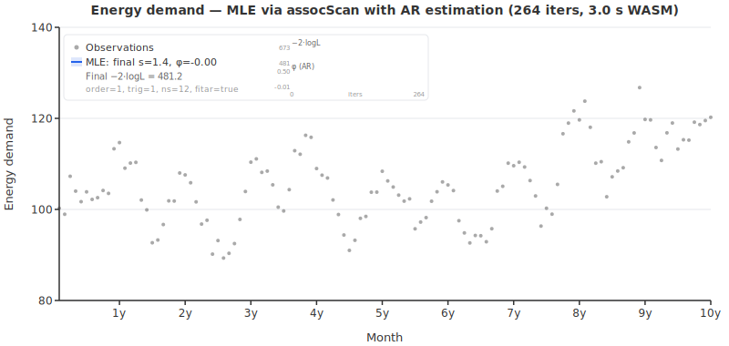
  <br/><br/>
  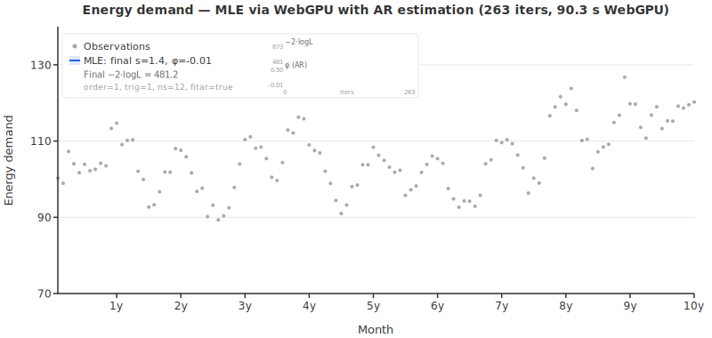
</p>

*Joint estimation of observation noise s, state variances w, and AR(1) coefficient φ via autodiff (`dlmMLE` with `fitAr: true`). Shows the combined signal F·x ± 2σ converging. Two sparklines track convergence: −2·log-likelihood (amber) and AR coefficient φ (green, 0.50 → 0.68, true: 0.85).*

The Nile MLE demo estimates `obsStd` and `processStd` on the classic Nile dataset; the energy MLE demo jointly estimates `obsStd`, `processStd`, and AR coefficient `φ` on the synthetic energy model (`fitAr: true`). See [Parameter estimation (maximum likelihood): MATLAB DLM vs dlm-js](#parameter-estimation-maximum-likelihood-matlab-dlm-vs-dlm-js) for details.

### How MLE works

Noise parameters are optimized in log-space: $s = e^{\theta_s}$, $w_i = e^{\theta_{w,i}}$. AR coefficients are optimized directly (unconstrained, not log-transformed — matching MATLAB DLM behavior). The optimizer is Adam with autodiff via `valueAndGrad()`.

The entire optimization step is wrapped in a single `jit()` call: `valueAndGrad(loss)` (Kalman filter forward pass + AD backward pass) and optax Adam parameter update. The `jit()` compilation happens on the first iteration; subsequent iterations run from compiled code.

**Performance**: on the `wasm` backend, one Nile MLE run (100 observations, m = 2) converges in ~122 iterations (~2.6 s) with the default Adam b2=0.9.

**Two loss paths:** `dlmMLE` dispatches between two loss functions based on the `dtype` and backend:

- **CPU/WASM (any dtype):** `makeKalmanLoss` — sequential `lax.scan` forward filter (O(n) depth per iteration). For the energy demo (n=120, <!-- timing:energy-mle:iterations -->300<!-- /timing --> iters, ~<!-- timing:energy-mle:elapsed -->6.4 s<!-- /timing --> on WASM).
- **WebGPU + Float32:** `makeKalmanLossAssoc` — `lax.associativeScan` forward filter (O(log n) depth per iteration). Details below.

Both paths are wrapped in `jit(valueAndGrad(lossFn))` with optax Adam. The final refit after convergence calls `dlmFit` (which itself uses the parallel path on WebGPU).

#### `makeKalmanLossAssoc` — parallel MLE loss via associative scan

The parallel MLE loss function replaces the sequential Kalman forward pass inside `valueAndGrad` with the exact 5-tuple forward filter from [1, Lemmas 1–2]. Each timestep produces per-step Kalman gains directly. Gradients propagate through $\theta \to (W, V^2) \to$ scan elements $\to$ loss naturally because the element construction uses standard differentiable ops.

**Step-by-step derivation:**

1. **Parameter extraction (traced):** $\theta \xrightarrow{\exp} (s, w_0 \ldots w_{m-1}, \phi_1 \ldots \phi_p)$. Observation variance $V^2 = s^2$ (scalar); state noise $W = \text{diag}(w_i^2)$; $G$ updated with AR coefficients if `fitAr: true`.

2. **Per-timestep 5-tuple elements (Lemma 1):** For each timestep $t = 1 \ldots n$:

   $$S_t = F W F^\top + V^2, \quad K_t = W F^\top / S_t$$
   $$A_t = (I - K_t F) G, \quad b_t = K_t y_t, \quad C_t = (I - K_t F) W$$
   $$\eta_t = G^\top F^\top y_t / S_t, \quad J_t = G^\top F^\top F G / S_t$$

   Missing timesteps ($\text{mask}_t = 0$): $A_t = G$, $b_t = 0$, $C_t = W$, $\eta_t = 0$, $J_t = 0$.

   Blending uses float-mask arithmetic for clean autodiff behavior.

3. **First element (exact prior initialization):** $A_1 = 0$, $b_1 = x_0 + K_1 (y_1 - F x_0)$, $C_1 = C_0 - K_1 S_1 K_1^\top$, $\eta_1 = 0$, $J_1 = 0$.

4. **Prefix scan:** `lax.associativeScan(composeForward, {A, b, C, η, J})` composes all $n$ elements in O(log n) depth using Lemma 2:

   $$M = (I + C_i J_j + \epsilon I)^{-1}$$
   $$A_{ij} = A_j M A_i, \quad b_{ij} = A_j M (b_i + C_i \eta_j) + b_j, \quad C_{ij} = A_j M C_i A_j^\top + C_j$$
   $$\eta_{ij} = A_i^\top N (\eta_j - J_j b_i) + \eta_i, \quad J_{ij} = A_i^\top N J_j A_i + J_i$$

   where $N = I - J_j M C_i$ (push-through identity — only one matrix inverse per compose step).

5. **Filtered state/covariance recovery:**

   $$x_{\text{filt},t} = A_{\text{comp},t} \, x_0 + b_{\text{comp},t}$$
   $$C_{\text{filt},t} = A_{\text{comp},t} \, C_0 \, A_{\text{comp},t}^\top + C_{\text{comp},t} \quad \text{(symmetrized)}$$

   Note: $x_{\text{filt}}$ and $C_{\text{filt}}$ are new arrays produced by `np.add`, not aliases of the scan output — the scan pytree is safely disposed immediately after.

6. **One-step-ahead predictions (shift):** The prediction-error likelihood requires $x_{t|t-1}$ and $C_{t|t-1}$ (the *predicted* state before observing $y_t$):

   $$x_{\text{pred},0} = x_0, \quad x_{\text{pred},t} = G \, x_{\text{filt},t-1} \quad (t \geq 1)$$
   $$C_{\text{pred},0} = C_0, \quad C_{\text{pred},t} = G \, C_{\text{filt},t-1} \, G^\top + W \quad (t \geq 1)$$

7. **Log-likelihood (prediction-error decomposition):**

   $$v_t = y_t - F \, x_{\text{pred},t}, \quad C_p^{(t)} = F \, C_{\text{pred},t} \, F^\top + V^2$$
   $$-2 \log L = \sum_{t=1}^{n} \text{mask}_t \left[ \frac{v_t^2}{C_p^{(t)}} + \log C_p^{(t)} \right]$$

   This is the same objective as the sequential path — both minimize the Kalman filter prediction-error decomposition.

### Parameter estimation (maximum likelihood): MATLAB DLM vs dlm-js

This comparison focuses on the univariate MLE workflow ($p=1$). For the original MATLAB DLM, see the [tutorial](https://mjlaine.github.io/dlm/dlmtut.html) and [source](https://github.com/mjlaine/dlm).

#### Objective function

Both optimize the same scalar likelihood form (for $p=1$ observations) — $-2 \log L$ from the Kalman filter prediction error decomposition:

$$-2 \log L = \sum_{t=1}^{n} \left[ \frac{v_t^2}{C_p^{(t)}} + \log C_p^{(t)} \right]$$

where $v_t = y_t - F x_{t|t-1}$ is the innovation and $C_p^{(t)} = F C_{t|t-1} F' + V^2$ is the innovation covariance. The `dlm_costfun` function (inside `dlmfit.m`) calls `dlmsmo(...,0,0)` (filter only, no smoother, no sample) and returns `out.lik`; we ran this under Octave. The dlm-js `makeKalmanLoss` in `src/mle.ts` computes the same per-step terms via `lax.scan` over the forward filter steps.

In practice, exact numeric equality is not expected because initialization and optimization procedures differ (e.g., `dlmfit` uses a two-pass prefit for initial state/covariance before optional optimization, as run under Octave).

#### Parameterization

| Aspect | dlm-js | MATLAB DLM |
|--------|--------|-----------|
| Observation noise $s$ | Always fitted: $s = e^{\theta_s}$ | Optionally fitted as a multiplicative factor $V \cdot e^{\theta_v}$ (controlled by `options.fitv`) |
| State noise $w$ | $W_{ii} = (e^{\theta_{w,i}})^2$ via `buildDiagW` | $W_{ii} = (e^{\theta_{w,i}})^2$ |
| AR coefficients | Directly optimized (not log-transformed): $G(\text{arInds}) = \theta_\phi$ via `buildG` rank-1 update (AD-safe) | Directly optimized (not log-transformed): $G(\text{arInds}) = \theta_\phi$ |
| Parameter grouping | Each $W_{ii}$ is an independent parameter | `options.winds` maps $\text{diag}(W)$ entries to shared parameters (e.g., `winds=[1,1,2,2]` ties states 1&2 and 3&4) |

Both use the same positivity enforcement: log-space for variance parameters, then $e^{(\cdot)}$ to map back. The MATLAB version has an extra feature — `winds` — that lets you **tie** $\text{diag}(W)$ entries to shared parameters, reducing the optimization dimension when multiple states should share the same noise variance.

#### Optimizer

| Aspect | dlm-js | MATLAB DLM |
|--------|--------|-----------|
| **Algorithm** | Adam (gradient-based, 1st-order momentum) | `fminsearch` (Nelder-Mead simplex) |
| **Gradient computation** | **Autodiff** via `valueAndGrad()` + reverse-mode AD through `lax.scan` | **None** — derivative-free |
| **Convergence** | Adaptive first-order method with bias-corrected moments; practical convergence depends on learning rate and objective conditioning | Simplex shrinkage heuristic (no guaranteed rate for non-convex objectives) |
| **Cost per optimizer step** | One `valueAndGrad` evaluation (forward + reverse AD through the loss) plus Adam state update | Multiple likelihood evaluations per simplex update (depends on dimension and simplex operations) |
| **Typical run budget** | 200 optimizer iterations (`maxIter` default) | 400 function evaluations (`options.maxfuneval` default) |
| **Compilation** | Optimization step is wrapped in a single `jit()`-traced function (forward filter + AD + Adam update) | None (interpreted; tested under Octave, or optional `dlmmex` C MEX) |
| **Jittability** | Fully jittable — optax Adam (as of v0.4.0, `count.item()` fix) | N/A |
| **Adam defaults** | `b1=0.9, b2=0.9, eps=1e-8` — b2=0.9 converges ~3× faster than canonical 0.999 on DLM likelihoods (measured across Nile, Kaisaniemi, ozone benchmarks) | N/A |
| **WASM performance** | ~<!-- timing:ckpt:nile:false-s -->1.8 s<!-- /timing --> for 60 iterations (Nile, n=100, m=2, b2=0.9, `checkpoint: false`); see [checkpointing note](#gradient-checkpointing) | N/A |

**Key tradeoff**: Nelder-Mead needs only function evaluations (no gradients), making it simple to apply and often robust on noisy/non-smooth surfaces. But cost grows quickly with parameter dimension because simplex updates require repeated objective evaluations. Adam with autodiff has higher per-step compute cost, but uses gradient information and often needs fewer optimization steps on smooth likelihoods like DLM filtering objectives.

##### MLE vs MCMC: different objectives

Pure MLE minimises $-2 \log L$ without any prior on $W$. On real data such as satellite ozone measurements, this can produce degenerate solutions — e.g. most seasonal noise variances collapse to near-zero while one or two grow large — because the likelihood surface has a wide, nearly flat ridge. MATLAB MCMC uses a normal prior on $\log W$ entries that keeps them symmetric and away from zero, yielding a posterior mean at much higher $-2\log L$ but visually smoother, better-regularised results.

| Point | dlm-js MLE | MATLAB MCMC |
|-------|------------|------------|
| Ozone $-2\log L$ at MATLAB posterior W | — | 435.6 |
| Ozone $-2\log L$ at MLE optimum | 203.8 | — |
| Ozone trend shape | Same global trend, but seasonal W values degenerate | Smooth, symmetric seasonal noise |

If MCMC-like regularisation is needed, the recommended approach is MAP estimation: add a log-normal penalty on $W$ entries to the loss before differentiating. dlm-js `makeKalmanLoss` is a plain differentiable function and the penalty can be added outside of it before wrapping in `jit(valueAndGrad(...))`.

#### Benchmark: same machine, same data

All timings measured on the same machine. The MATLAB DLM toolbox was run under Octave with `fminsearch` (Nelder-Mead, `maxfuneval=400` for Nile models, `maxfuneval=800` for Kaisaniemi). dlm-js uses `dlmMLE` (Adam + autodiff, `maxIter=300`, `b2=0.9` default, `checkpoint: false`, `wasm` backend). Octave timings are median of 5 runs after 1 warmup; dlm-js timings are single fresh-run wall-clock times (including first-call JIT overhead).

| Model | $n$ | $m$ | params | dlm-js `dlmMLE` (wasm) | Octave `fminsearch` | $-2\log L$ (dlm-js) | $-2\log L$ (Octave) |
|-------|---|---|--------|------------------------|---------------------|-----------------|-----------------|
| Nile, order=1, fit s+w | 100 | 2 | 3 | <!-- timing:nile-mle:elapsed -->3050 ms<!-- /timing --> | 2827 ms | <!-- timing:mle-bench:nile-order1:lik -->1104.9<!-- /timing --> | 1104.6 |
| Nile, order=1, fit w only | 100 | 2 | 2 | — | 1623 ms | — | 1104.7 |
| Nile, order=0, fit s+w | 100 | 1 | 2 | <!-- timing:mle-bench:nile-order0:elapsed -->1847 ms<!-- /timing --> | 610 ms | <!-- timing:mle-bench:nile-order0:lik -->1095.8<!-- /timing --> | 1095.8 |
| Kaisaniemi, trig, fit s+w | 117 | 4 | 5 | <!-- timing:mle-bench:kaisaniemi:elapsed -->5928 ms<!-- /timing --> | **failed** (NaN/Inf) | <!-- timing:mle-bench:kaisaniemi:lik -->341.3<!-- /timing --> | — |
| Energy, trig+AR, fit s+w+φ | 120 | 5 | 7 | <!-- timing:energy-mle:elapsed-ms -->6399 ms<!-- /timing --> | — | <!-- timing:energy-mle:lik -->443.1<!-- /timing --> | — |

Octave timings are from Octave with `fminsearch`; dlm-js timings are single fresh-run wall-clock times (including JIT overhead) from `pnpm run bench:mle`.

**Key observations:**
- **Nile (n=100, m=2):** Octave `fminsearch` is <!-- computed:static("octave-nile-order1-elapsed-ms") < slot("nile-mle:elapsed") ? "faster" : "slower" -->faster<!-- /computed --> (see table). dlm-js includes one-time JIT compilation overhead in the reported time.
- **Likelihood values:** Both converge to very similar $-2\log L$ values on Nile (difference ~<!-- computed:Math.abs(slot("mle-bench:nile-order1:lik") - static("octave-nile-order1-lik")).toFixed(1) -->0.3<!-- /computed -->).
- **Kaisaniemi (m=4, 5 params):** Octave `fminsearch` (`maxfuneval=800`) failed with NaN/Inf; dlm-js converged in <!-- timing:mle-bench:kaisaniemi:iterations -->300<!-- /timing --> iterations (~<!-- timing:mle-bench:kaisaniemi:elapsed-s -->5.9 s<!-- /timing -->), reaching $-2\log L =$ <!-- timing:mle-bench:kaisaniemi:lik -->341.3<!-- /timing -->.
- **Joint $s+w$ fitting:** dlm-js always fits both $s$ and $w$; MATLAB DLM can fit $w$ only (`fitv=0`).

##### Gradient checkpointing

`lax.scan` supports gradient checkpointing via a `checkpoint` option: `true` (default, √n segments), `false` (store all carries), or an explicit segment size.

**Benchmark (WASM, Float64, 60 iterations):**

| Dataset | n | m | `checkpoint: false` ($n$) | `checkpoint: true` ($\sqrt{n}$) | speedup |
|---------|---|---|--------------------|-----------------------|---------|
| Nile, order=1 | 100 | 2 | <!-- timing:ckpt:nile:false-ms -->1781 ms<!-- /timing --> | <!-- timing:ckpt:nile:true-ms -->1775 ms<!-- /timing --> | <!-- timing:ckpt:nile:speedup -->0%<!-- /timing --> |
| Energy, order=1+trig1+ar1 | 120 | 5 | <!-- timing:ckpt:energy:false-ms -->2205 ms<!-- /timing --> | <!-- timing:ckpt:energy:true-ms -->2191 ms<!-- /timing --> | <!-- timing:ckpt:energy:speedup -->-1%<!-- /timing --> |


#### MCMC (MATLAB DLM only)

The MATLAB DLM toolbox supports MCMC via Adaptive Metropolis (`mcmcrun`): 5000 simulations, log-normal priors, full posterior chain with credible intervals, and disturbance smoother for Gibbs-style state sampling.

**dlm-js has no MCMC equivalent** — `dlmMLE` returns a point estimate only. Possible future directions:
- Hessian at the MLE optimum for approximate confidence intervals
- Stochastic gradient MCMC (e.g., SGLD) using the existing AD infrastructure

#### Feature comparison summary

| Capability | dlm-js `dlmMLE` | MATLAB DLM |
|-----------|-----------------|-----------|
| MLE point estimate | ✅ Adam + autodiff | ✅ `fminsearch` |
| Gradient-based optimization | ✅ | ❌ |
| JIT compilation of optimizer | ✅ | ❌ |
| Fit observation noise `obsStd` | ✅ (always) | ✅ (optional via `fitv`) |
| Fit process noise `processStd` | ✅ | ✅ |
| Fit AR coefficients `arCoefficients` | ✅ (`fitAr: true`) | ✅ |
| Tie W parameters (`winds`) | ❌ (each W entry independent) | ✅ |
| Custom cost function | ❌ | ✅ (`options.fitfun`) |
| MCMC posterior sampling | ❌ | ✅ (Adaptive Metropolis via `mcmcrun`) |
| State sampling for Gibbs | ❌ | ✅ (disturbance smoother) |
| Posterior uncertainty | ❌ (point estimate only) | ✅ (full chain) |
| Convergence diagnostics | ⚠️ Limited (`devianceHistory`, no posterior chain) | ✅ (`chain`, `sschain` in MCMC mode) |
| Runs in browser | ✅ | ❌ |
| MEX/WASM acceleration | ✅ (`wasm` backend; see [benchmark](#benchmark-same-machine-same-data)) | ✅ (`dlmmex` optional) |
| Irregular timestamps | ✅ (`timestamps` in `dlmFit`; see [irregular timestamps](#irregular-timestamps)) | ❌ (unit spacing only) |

#### What dlm-js does differently

1. **Exact gradients** vs derivative-free simplex — for smooth likelihoods this often improves optimizer guidance, especially as parameter dimension grows (the Kaisaniemi benchmark is one example).
2. **JIT-wrapped optimization step** — forward filter + AD + parameter update are traced together in one optimization step function. JIT overhead currently dominates for small datasets (n=100); the advantage grows with larger n or more complex models.
3. **WASM backend** — runs in Node.js and the browser without native dependencies.
4. **Potentially more robust as dimension grows** — gradient-based optimization can remain practical in settings where derivative-free simplex methods become expensive or unstable.
5. **Joint AR coefficient estimation** — `fitAr: true` jointly estimates observation noise, state variances, and AR coefficients in a single autodiff pass. The AR coefficients enter the G matrix via AD-safe rank-1 updates (`buildG`), keeping the entire optimization `jit()`-compilable.

#### What MATLAB DLM does that dlm-js doesn't (yet)

1. **MCMC posterior sampling** — full Bayesian uncertainty quantification with priors.
2. **Parameter tying** (`winds`) — reduces optimization dimension for structured models.
3. **Custom fit functions** (`options.fitfun`) — user-supplied cost functions.
4. **V factor fitting** (`options.fitv`) — fits a multiplicative factor on V rather than V directly (useful when V is partially known from instrument specification).

## Project structure

```text
├── .github/             # GitHub configuration
├── assets/              # Generated images and timing sidecars
├── dist/                # Compiled and bundled output (after build)
├── docs/                # Generated API documentation (after `pnpm run docs`, gitignored)
├── issues/              # Drafted GitHub issues for upstream jax-js-nonconsuming
├── scripts/             # SVG generators, frame collectors, benchmark runners, timing automation
├── src/                 # Library TypeScript sources
├── tests/               # Test suite (TypeScript tests, JSON fixtures, Octave reference generators)
├── tmp/                 # Scratch / temp directory for agents and debug (gitignored)
├── eslint.config.ts     # ESLint configuration (jax-js-nonconsuming memory rules)
├── LICENSE              # License (does not apply to tests/octave/dlm/)
├── package.json         # Node.js package information
├── README.md            # This readme
├── tsconfig.json        # Configuration file of the TypeScript project
├── typedoc.json         # TypeDoc API documentation configuration
└── vite.config.ts       # Configuration file of the Vite project
```

## Included MATLAB sources (`tests/octave/dlm/`)

The `dlm/` directory contains a curated subset of Marko Laine's [dlm](https://mjlaine.github.io/dlm/dlmtut.html) and [mcmcstat](https://mjlaine.github.io/mcmcstat/) MATLAB toolboxes — just enough to run the Kalman filter and RTS smoother without MCMC or optimization dependencies. Licensing for this included subset is documented in [`tests/octave/dlm/LICENSE.txt`](tests/octave/dlm/LICENSE.txt).

## Development

### Prerequisites

* **Node.js**: [Install Node.js](https://nodejs.org/en/download/) to run JavaScript locally.
* **pnpm**: Install globally via `npm install -g pnpm`.
* **Octave**: Version 10.3.0 is known to work. Install and add `octave-cli` to your system path.

### Install dependencies

```shell
pnpm install
```

### Building and bundling

This project is written in TypeScript. You need to build (compile) it before use:

```shell
pnpm run build
```
This does two things:
  - **Compiles TypeScript (`src/index.ts`) to ESM and CommonJS JavaScript (`dist/dlm-js.es.js`, `dist/dlm-js.cjs.js`) and type definitions (`dist/index.d.ts`).** TypeScript lets you write code with types, but Node.js and browsers only run JavaScript. The build step converts your code to JavaScript.
  - **Bundles the code with Vite for use as a library (outputs ESM and CommonJS formats in `dist/`).** Vite bundles your code so it can be used easily in other projects, in Node.js or browsers, and optimizes it for distribution.

### Testing

#### Generate reference output using Octave

```shell
pnpm run test:octave
```

This generates Octave reference outputs:
- `tests/niledemo-out-m.json` (from `niledemo.m` — pre-existing MATLAB DLM demo)
- `tests/{order0,order2,seasonal,trig,trigar,level,energy,ar2}-out-m.json` (from `gensys_tests.m` — generated for this project)
- `tests/kaisaniemi-out-m.json` (from `kaisaniemi_demo.m` — Kaisaniemi seasonal demo)

It will also generate test input files unless they already exist.

#### Run tests

You can run all tests directly (no build step needed) with:

```shell
pnpm vitest run
```

or

```shell
pnpm run test:node
```

This runs `niledemo.test.ts`, `gensys.test.ts`, `synthetic.test.ts`, `mle.test.ts`, `covariate.test.ts`, and `ozone.test.ts` against all available device × dtype combinations. Vitest compiles TypeScript on the fly.

To run the full CI-local check (lint + Octave reference generation + tests):

```shell
pnpm run test
```

#### Synthetic ground-truth tests

In addition to the Octave reference tests above, `synthetic.test.ts` generates state-space data from a **known generating process** with known true hidden states (using a seeded PRNG with Box-Muller transform for reproducible Gaussian noise). The DLM smoother is then tested against mathematical ground truth rather than another implementation's rounding:

- **Finite outputs**: No NaN/Inf in any result field
- **Positive covariance**: Smoothed covariance diagonals `C[k][k][t] > 0` for all states and timesteps
- **Noise reduction**: Smoother RMSE < observation RMSE (the smoother actually reduces noise)
- **Calibrated uncertainty**: True states fall within the 95% posterior credible intervals at roughly the nominal rate

Models tested: local level (m=1) at moderate/high/low SNR, local linear trend (m=2), trigonometric seasonal (m=6), and full seasonal (m=13). All run across the full device × dtype matrix. Float32 is skipped for m > 2 (see [scan algorithm / Float32 stabilization](#scan-algorithm)).

## TODO

* Float32 backward-smoother stabilization — experimental `DlmStabilization` flags already implemented (`cEps` gives −29% max error); next steps: evaluate log-Cholesky / modified-Cholesky parameterizations, consider making `cEps` the f32 default, or collapse the 7-flag interface to a simpler enum before documenting
* Multivariate observations (p > 1) — biggest remaining gap; affects all matrix dimensions throughout the filter/smoother (dlm-js currently assumes scalar observations, p = 1)
* Test the built library (in `dist/`)
* MCMC parameter estimation — depends on Marko Laine's `mcmcrun` toolbox; would require porting or replacing the MCMC engine
* State sampling (disturbance smoother) — blocked on MCMC
* Human review the AI-generated DLM port

## References

1. Särkkä, S. & García-Fernández, Á. F. (2020). [Temporal Parallelization of Bayesian Smoothers](https://arxiv.org/abs/1905.13002). *IEEE Transactions on Automatic Control*, 66(1), 299–306. doi:[10.1109/TAC.2020.2976316](https://doi.org/10.1109/TAC.2020.2976316). — Lemmas 1–2: exact parallel forward Kalman filter (5-tuple elements + associative composition); Lemmas 3–4 + Theorem 2: parallel backward smoother (linear/Gaussian specialization). dlm-js uses Lemmas 1–2 (forward filter) and Lemmas 3–4 (backward smoother).
2. Pyro contributors. [Forecasting II: state space models](https://pyro.ai/examples/forecasting_ii.html). — Parallel-scan Kalman filtering on 78,888-step BART ridership data.
3. NumPyro contributors. [Example: Enumerate Hidden Markov Model](https://num.pyro.ai/en/latest/examples/hmm_enum.html). — Parallel-scan HMM inference using [1].
4. Razavi, H., García-Fernández, Á. F. & Särkkä, S. (2025). Temporal Parallelisation of Continuous-Time MAP Trajectory Estimation. *Preprint*. — Extends [1] to continuous-time MAP estimation with exact associative elements for irregular timesteps; see [irregular timestamps](#irregular-timestamps).

### Authors
* Marko Laine -- Original DLM and mcmcstat sources in `tests/octave/dlm/` and `tests/octave/niledemo.m`
* Olli Niemitalo (Olli.Niemitalo@hamk.fi) -- Supervision of AI coding agents

### Copyright
* 2013-2017 Marko Laine -- Original DLM and mcmcstat sources in `tests/octave/dlm/` and `tests/octave/niledemo.m`
* 2026 HAMK Häme University of Applied Sciences
  
### License
This project is MIT licensed (see [`LICENSE`](LICENSE)).

The included original DLM and mcmcstat MATLAB subset in [`tests/octave/dlm/`](tests/octave/dlm/) is covered by its own license text in [`tests/octave/dlm/LICENSE.txt`](tests/octave/dlm/LICENSE.txt).
