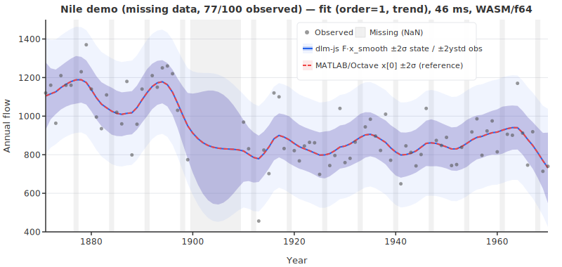
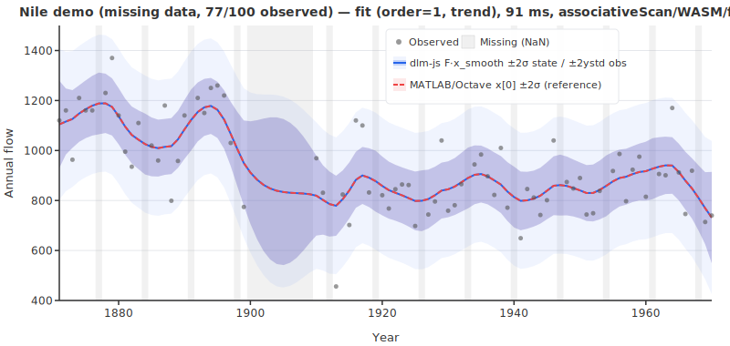

# dlm-js — TypeScript Kalman filter/smoother with autodiff MLE

<strong>
  <a href="https://hamk-uas.github.io/dlm-js/">API Reference</a> |
  <a href="https://github.com/hamk-uas/dlm-js">GitHub</a> |
  <a href="https://mjlaine.github.io/dlm/">Original DLM Docs</a> |
  <a href="https://github.com/mjlaine/dlm">Original DLM GitHub</a>
</strong>

A TypeScript Kalman filter + RTS smoother library using [jax-js-nonconsuming](https://github.com/hamk-uas/jax-js-nonconsuming), inspired by [dynamic linear model](https://mjlaine.github.io/dlm/dlmtut.html) (MATLAB). Extends the original with autodiff-based MLE via `jit(valueAndGrad + Adam)` and an exact O(log N) parallel filter+smoother via `lax.associativeScan` (Särkkä & García-Fernández 2020).

🤖 AI generated code & documentation with gentle human supervision.


*Nile demo (sequential scan): first smoothed state (level) `x[0]` from dlm-js (solid blue) vs MATLAB/Octave dlm (dashed red), with ± 2σ bands from `xstd[:,0]` (state uncertainty, not observation prediction intervals). Regenerate with `pnpm run gen:svg`.*


*Nile demo (assoc): same model via `run: { algorithm: 'assoc' }` — exact O(log N) parallel filter+smoother (Särkkä & García-Fernández 2020). Results match sequential scan to within numerical tolerance (validated by `assocscan.test.ts`). Regenerate with `pnpm run gen:svg`.*


*Kaisaniemi seasonal demo (sequential scan, from `mjlaine/dlm` example data): top panel shows level state `x[0] ± 2σ`; bottom panel shows covariance-aware combined signal `x[0]+x[2] ± 2σ`, using `Var(x0+x2)=Var(x0)+Var(x2)+2Cov(x0,x2)`. dlm-js (solid blue) vs MATLAB/Octave (dashed red). Model settings: `order=1`, `trig=1`, `s=2`, `w=[0,0.005,0.4,0.4]`. Regenerate with `pnpm run gen:svg`.*


*Kaisaniemi seasonal demo (assoc): same model via `run: { algorithm: 'assoc' }` (exact O(log N) parallel filter+smoother, Särkkä & García-Fernández 2020). Results validated against Octave reference by `assocscan.test.ts`. Regenerate with `pnpm run gen:svg`.*


*Energy demand demo (sequential scan, synthetic, 10 years monthly): data generated from the DLM state-space model itself with a seeded RNG. Panels top to bottom: smoothed level `x[0] ± 2σ`, trigonometric seasonal `x[2] ± 2σ`, AR(1) state `x[4] ± 2σ`, and covariance-aware combined signal `F·x = x[0]+x[2]+x[4] ± 2σ`. True hidden states from the generating process (green dashed) are overlaid, showing how well the RTS smoother recovers the ground truth. dlm-js (solid blue) vs MATLAB/Octave (dashed red). Model settings: `order=1`, `trig=1`, `ns=12`, `arphi=[0.85]`, `s=1.5`, `w=[0.3,0.02,0.02,0.02,2.5]`, m=5. Regenerate with `pnpm run gen:svg`.*


*Energy demand demo (assoc): same model via `run: { algorithm: 'assoc' }` (exact O(log N) parallel filter+smoother, Särkkä & García-Fernández 2020). Results validated against Octave reference by `assocscan.test.ts`. Regenerate with `pnpm run gen:svg`.*


*Nile MLE demo (`lax.scan`, sequential): parameter estimation via autodiff (`dlmMLE`). Orange dashed = initial variance-based guess, blue solid = MLE optimum. The entire optimization step — `valueAndGrad` (Kalman filter forward + AD backward) and Adam parameter update — is wrapped in a single `jit()` call. Estimated observation noise s = 121.1 (known: 122.9), -2·log-likelihood = 1105.0. Regenerate with `pnpm run gen:svg`.*


*Nile MLE demo (`assoc`, parallel): same model estimated via `makeKalmanLossAssoc` — uses exact 5-tuple forward filter from Särkkä & García-Fernández [1, Lemmas 1–2] + O(log n) `lax.associativeScan` prefix scan. Regenerate with `pnpm run gen:svg`.*


*Nile MLE demo (WebGPU, `assoc`): same model via `makeKalmanLossAssoc` on the `webgpu` backend + Float32. Slower than WASM at n=100 due to GPU dispatch overhead at small sequence lengths; WebGPU pays off at large N where O(log n) depth beats WASM's O(n) sequential filter. Regenerate with `pnpm run gen:svg`.*


*Energy MLE demo (`lax.scan`, sequential) with AR coefficient estimation: joint estimation of observation noise s, state variances w, and AR(1) coefficient φ via autodiff (`dlmMLE` with `fitar: true`). Shows the combined signal F·x ± 2σ converging from a variance-based initial guess (orange dashed) to the MLE optimum (blue solid). Two sparklines track convergence: −2·log-likelihood (amber) and AR coefficient φ (green, 0.50 → 0.68, true: 0.85). Model: `order=1`, `trig=1`, `ns=12`, m=5. Regenerate with `pnpm run gen:svg`.*


*Energy MLE demo (`assoc`, parallel) with AR coefficient estimation: same model via `makeKalmanLossAssoc`. Regenerate with `pnpm run gen:svg`.*


*Energy MLE demo (WebGPU, `assoc`) with AR coefficient estimation: same model via `makeKalmanLossAssoc` on the `webgpu` backend + Float32. Regenerate with `pnpm run gen:svg`.*


*Stratospheric ozone demo (sequential scan, Laine, Latva-Pukkila & Kyrölä (2014), [ACP 14, 9707–9725](https://doi.org/10.5194/acp-14-9707-2014), replication via `dlmFit`): top panel shows O₃ density (SAGE II / GOMOS observations, 1984–2011; data file from [mjlaine/dlm](https://github.com/mjlaine/dlm/tree/master/examples)) with the smoothed level state ± 2σ (dlm-js solid blue, MATLAB/Octave dashed red) and a 15-year (180-month) `dlmForecast` trend extrapolation beyond the last observation (dashed green, ± 2σ level-state uncertainty, shaded region — the level state x[0] is plotted rather than the full observation prediction, which would oscillate with the seasonal harmonics); bottom panel shows proxy covariate contributions — solar cycle (β̂·X_solar, amber) and QBO (β̂_qbo1·X₁ + β̂_qbo2·X₂, purple). Model: `order=1`, `trig=2`, `ns=12`, 3 static-β covariates, state dimension m=9. Forecast interpretation note: this is a conditional forecast under the chosen future proxy path assumptions (unknown future proxies are not inferred by the model). Regenerate with `pnpm run gen:svg`.*


*Stratospheric ozone demo (assoc): same m=9 model via `run: { algorithm: 'assoc' }` (exact O(log N) parallel filter+smoother, Särkkä & García-Fernández 2020). The large state dimension (m=9) is a meaningful performance test of the associative scan path. Data: Laine, Latva-Pukkila & Kyrölä (2014), [ACP 14, 9707–9725](https://doi.org/10.5194/acp-14-9707-2014); SAGE II / GOMOS instruments; data file from [mjlaine/dlm](https://github.com/mjlaine/dlm/tree/master/examples). Regenerate with `pnpm run gen:svg`.*



*Missing-data demo (sequential scan): Nile flow (n=100) with 23 NaN observations — every 7th year and years 1900–1909 removed. Gray bands mark missing timesteps. Outer light band: observation prediction interval `F·x_smooth ± 2·ystd` (wider over the gap — both the centre `F·x_smooth` and the width `ystd` are RTS-smoothed); inner opaque band: state uncertainty `x[0] ± 2·xstd[0]`. dlm-js (blue) vs MATLAB/Octave (dashed red). The smoother interpolates continuously through all gaps with no extra configuration: pass `NaN` in `y` and `result.nobs` = 77 (non-NaN count). Regenerate with `pnpm run gen:svg`.*



*Missing-data demo (assoc): same NaN-handling model via `run: { algorithm: 'assoc' }` (exact O(log N) parallel filter+smoother, Särkkä & García-Fernández 2020). NaN masking validated against Octave reference by `assocscan.test.ts`. Regenerate with `pnpm run gen:svg`.*

### Backend performance

`dlmFit` warm-run timings (jitted core, second of two sequential runs) and maximum errors vs. the Octave/MATLAB reference (worst case across all 4 models and all outputs: yhat, ystd, x, xstd) for each `DlmRunConfig` combination — backend × dtype × algorithm × stabilization. `assoc + joseph` is an invalid combination and throws. Regenerate with `pnpm run bench:full`. **†** marks the combination used when `run: {}` is passed: f64 → scan + none; f32 → scan + joseph; webgpu/f32 → assoc (no explicit stabilization).

Models: Nile order=0 (n=100, m=1) · Nile order=1 (n=100, m=2) · Kaisaniemi trig (n=117, m=4) · Energy trig+AR (n=120, m=5). Benchmarked on: <!-- computed:static("machine") -->Intel(R) Core(TM) Ultra 5 125H, 62 GB RAM<!-- /computed --> · GPU: <!-- computed:static("gpu") -->GeForce RTX 4070 Ti SUPER (WebGPU adapter)<!-- /computed -->.

| backend | dtype | algorithm | stab | Nile o=0 | Nile o=1 | Kaisaniemi | Energy | max \|Δ\| | max \|Δ\|% |
|---------|-------|-----------|------|----------|----------|------------|--------|----------|------------|
| cpu | f64 | scan | none | **166 ms †** | **358 ms †** | **435 ms †** | **478 ms †** | 3.78e-8 | 1.62e-4 |
| cpu | f64 | scan | joseph | 191 ms | 389 ms | 481 ms | 528 ms | 9.38e-11 | 3.56e-9 |
| cpu | f64 | assoc | none | 74 ms | 201 ms | 853 ms | 1534 ms | 5.12e-9 | 2.17e-5 |
| cpu | f32 | scan | none | 171 ms | 345 ms | 439 ms | 482 ms | ⚠️ 180 | ⚠️ 1.4e6 |
| cpu | f32 | scan | joseph | **184 ms †** | **384 ms †** | **484 ms †** | **533 ms †** | 1.32e-2 | 0.17 |
| cpu | f32 | assoc | none | 67 ms | 204 ms | 869 ms | 1552 ms | 4.93e-3 | 19.7 |
| wasm | f64 | scan | none | **16 ms †** | **20 ms †** | **22 ms †** | **23 ms †** | 3.78e-8 | 1.62e-4 |
| wasm | f64 | scan | joseph | 18 ms | 22 ms | 22 ms | 22 ms | 9.38e-11 | 3.56e-9 |
| wasm | f64 | assoc | none | 24 ms | 25 ms | 32 ms | 39 ms | 5.12e-9 | 2.17e-5 |
| wasm | f32 | scan | none | 15 ms | 20 ms | 21 ms | 19 ms | ⚠️ 7000 | ⚠️ 2e6 |
| wasm | f32 | scan | joseph | **17 ms †** | **20 ms †** | **24 ms †** | **21 ms †** | 3.99e-2 | 1.37 |
| wasm | f32 | assoc | none | 23 ms | 24 ms | 33 ms | 36 ms | 4.93e-3 | 21.9 |
| webgpu | f32 | scan | none | 549 ms | 913 ms | 1011 ms | 1141 ms | ⚠️ 110 | ⚠️ 6.7e4 |
| webgpu | f32 | scan | joseph | 712 ms | 888 ms | 1041 ms | 1169 ms | 2.49e-2 | 1.32 |
| webgpu | f32 | assoc | none | **325 ms †** | **353 ms †** | **356 ms †** | **372 ms †** | 4.93e-3 | 19.8 |

⚠️ = numerically unstable: f32 + scan + none without Joseph-form stabilization blows up for larger state dimensions (m ≥ 4). Both columns show worst case across all 4 benchmark models and all output variables (yhat, ystd, x, xstd). `max |Δ|%` uses the Octave reference value as denominator; percentages >1% in the `assoc` rows come from small xstd values (not from yhat/ystd).

**Key findings:**
- **WASM is ~10–20× faster than CPU** — the JS interpreter backend has significant overhead for small matrix operations.
- **`assoc` on CPU is faster for small m, slower for large m** — for m=1–2, the scan composition is cheap and reduces interpreter overhead; for m=4–5 the extra matrix operations dominate (~2× slower than `scan` on CPU).
- **`assoc` on WASM has no warm-run advantage over `scan`** — warm times are nearly identical (~20–40 ms) for all models; the first-run cost is ~5× higher due to extra JIT compilation paths, so prefer `scan` on WASM unless you need the parallel path explicitly.
- **`assoc + joseph` is an error** — `stabilization: 'joseph'` combined with an explicit `algorithm: 'assoc'` throws at runtime. The assoc path always applies its own numerically stable formulation; use `assoc` without setting `stabilization`.
- **f32 + scan + none is dangerous for large models** — covariance catastrophically cancels for m ≥ 4; `joseph` form (or `assoc`) is required for float32 stability. The `assoc` path is stable with float32 even without joseph, as shown by the reasonable 4.93e-3 max error vs the ⚠️ 7000 for scan+none.
- **Joseph form overhead is negligible on WASM** — f32+joseph vs f64+none differ by <5 ms across all models, well within JIT variance. The stabilization choice is numerically important but not a performance concern.
- **WebGPU `assoc` is ~4× faster than WebGPU `scan`** for larger models (m=4–5) — sequential scan on WebGPU dispatches O(n) kernels (no GPU parallelism); `assoc` uses O(log n) dispatches (Kogge-Stone), cutting ms from ~1800 to ~450 for Energy.
- **WebGPU `scan` is the worst option** — 1800 ms warm for Energy (m=5) vs 29 ms on WASM; every filter step is a separate GPU dispatch with no cross-workgroup sync.
- **WASM stays flat up to N≈3200 (fixed overhead), then scales linearly** — asymptotic per-step cost ~1.6 µs/step, giving ~<!-- timing:scale:wasm-f64:n102400 -->156 ms<!-- /timing --> at N=102400. WebGPU/f32 `assoc` scales **sub-linearly (O(log n))**: a 1024× increase from N=100 to N=102400 only doubles the runtime (<!-- timing:scale:webgpu-f32:n100 -->305 ms<!-- /timing --> → <!-- timing:scale:webgpu-f32:n102400 -->648 ms<!-- /timing -->). A crossover is plausible at N≈800k–1M.
- **WebGPU results may differ slightly** from sequential WASM/f64 due to Float32 precision and operation reordering in the parallel scan, not from any algorithmic approximation — both paths use exact per-timestep Kalman gains.

For background on the Nile and Kaisaniemi demos and the original model formulation, see [Marko Laine's DLM page](https://mjlaine.github.io/dlm/). The energy demand demo uses synthetic data generated for this project. The Nile MLE demo estimates `s` and `w` on the classic Nile dataset; the energy MLE demo jointly estimates `s`, `w`, and AR coefficient `φ` on the synthetic energy model (`fitar: true`). The missing-data demo uses the same Nile dataset with 23 observations removed. See the [MLE comparison](https://github.com/hamk-uas/dlm-js/blob/main/mle-comparison.md) for details.

## Installation

dlm-js is not yet published to npm. Install directly from GitHub:

```shell
# npm
npm install github:hamk-uas/dlm-js

# pnpm
pnpm add github:hamk-uas/dlm-js
```

This also installs the `@hamk-uas/jax-js-nonconsuming` dependency automatically.

## Usage

dlm-js works in **both Node.js and the browser** — the library has no platform-specific code. It ships ESM, CommonJS, and TypeScript declarations.

Naming convention: exported JS/TS APIs use camelCase (for example `dlmFit`, `dlmGenSys`), while original MATLAB functions are lowercase (for example `dlmfit`, `dlmsmo`, `dlmgensys`).

### ESM (Node.js / browser bundler)

```js
import { dlmFit, dlmGenSys } from "dlm-js";
import { DType } from "@hamk-uas/jax-js-nonconsuming";

// Nile river annual flow data (excerpt)
const y = [1120, 1160, 963, 1210, 1160, 1160, 813, 1230, 1370, 1140];

// Fit a local linear trend model (order=1, state dim m=2)
const result = await dlmFit(y, 120, [40, 10], { order: 1 }, { dtype: DType.Float64 });

console.log(result.yhat);  // smoothed predictions [n]
console.log(result.x);     // smoothed states [m][n]
console.log(result.lik);   // -2·log-likelihood
// Also available: result.xstd [m][n], result.ystd [n], result.v [n],
//   result.resid2 [n], result.mse, result.mape, result.ssy, result.s2, result.nobs
```

For an order=1 model with `options.spline: true`, the W covariance is scaled to produce an integrated random walk (matches MATLAB `dlmfit` spline mode).

### CommonJS (Node.js)

```js
const { dlmFit } = require("dlm-js");
const { DType } = require("@hamk-uas/jax-js-nonconsuming");
```

### Generate system matrices only

```js
import { dlmGenSys } from "dlm-js";

const sys = dlmGenSys({ order: 1, trig: 2, ns: 12 });
console.log(sys.G);  // state transition matrix (m×m)
console.log(sys.F);  // observation vector (1×m)
console.log(sys.m);  // state dimension
```

### MLE parameter estimation

Estimate observation noise `s`, state noise `w`, and optionally AR coefficients by maximizing the Kalman filter log-likelihood via autodiff:

```js
import { dlmMLE } from "dlm-js";
import { DType, defaultDevice } from "@hamk-uas/jax-js-nonconsuming";

defaultDevice("wasm"); // recommended: ~30× faster than "cpu"

const y = [1120, 1160, 963, 1210, 1160, 1160, 813, 1230, 1370, 1140 /* ... */];

// Basic: estimate s and w
const mle = await dlmMLE(
  y,
  { order: 1 },           // model: local linear trend (m=2)
  undefined,              // auto initial guess from data variance
  300,                    // max iterations
  0.05,                   // Adam learning rate
  1e-6,                   // convergence tolerance
  { dtype: DType.Float64 },
);

console.log(mle.s);           // estimated observation noise std dev
console.log(mle.w);           // estimated state noise std devs
console.log(mle.lik);         // -2·log-likelihood at optimum
console.log(mle.iterations);  // iterations to convergence
console.log(mle.elapsed);     // wall-clock ms
console.log(mle.fit);         // full DlmFitResult with optimized parameters

// With AR fitting: estimate s, w, and AR coefficients jointly
const mleAR = await dlmMLE(
  y,
  { order: 0, arphi: [0.5], fitar: true },  // initial arphi + fitar flag
  undefined,
  300, 0.02, 1e-6, { dtype: DType.Float64 },
);
console.log(mleAR.arphi);     // estimated AR coefficients (e.g. [0.81])
```

The entire optimization step is wrapped in a single `jit()` call: `valueAndGrad(loss)` (Kalman filter forward pass + AD backward pass) and optax Adam parameter update. Noise parameters are unconstrained via log-space: `s = exp(θ_s)`, `w[i] = exp(θ_{w,i})`. AR coefficients are optimized directly (unconstrained, not log-transformed — matching MATLAB DLM behavior).

**Two MLE loss paths:** The Kalman filter inside the loss function follows the `run` config: `algorithm: 'scan'` (the default) uses sequential `lax.scan` (O(n) depth); `algorithm: 'assoc'` uses `makeKalmanLossAssoc` with `lax.associativeScan` (O(log n) depth), using the exact 5-tuple forward filter from [1, Lemmas 1–2]. Both paths minimize the same prediction-error likelihood $-2\log L = \sum_t [v_t^2/C_p^{(t)} + \log C_p^{(t)}]$. See [mle-comparison.md](mle-comparison.md#makekalmanLossAssoc--parallel-mle-loss-via-associative-scan) for the full derivation.

**Performance**: on the `wasm` backend, one Nile MLE run (100 observations, m = 2) converges in ~122 iterations (~2.6 s) with the default Adam b2=0.9. The `jit()` compilation happens on the first iteration; subsequent iterations run from compiled code.

For a detailed comparison of dlm-js MLE vs the original MATLAB DLM parameter estimation (Nelder-Mead, MCMC), see the [MLE comparison](https://github.com/hamk-uas/dlm-js/blob/main/mle-comparison.md).

### h-step-ahead forecasting

Propagate the last smoothed state h steps forward with no new observations:

```js
import { dlmFit, dlmForecast } from "dlm-js";
import { DType } from "@hamk-uas/jax-js-nonconsuming";

const y = [1120, 1160, 963, 1210, 1160, 1160, 813, 1230, 1370, 1140];

// Fit a local linear trend model
const fit = await dlmFit(y, 120, [40, 10], { order: 1 }, { dtype: DType.Float64 });

// Forecast 12 steps ahead
const fc = await dlmForecast(fit, 120, 12, { dtype: DType.Float64 });

console.log(fc.yhat);  // predicted observation means [h] = F·x_pred
console.log(fc.ystd);  // observation prediction std devs [h] — grows monotonically
console.log(fc.x);     // state trajectories [m][h]
console.log(fc.h);     // 12
console.log(fc.m);     // 2 (state dimension)
```

`fc.yhat` is the full observation prediction `F·x_pred`. For pure trend models (no seasonality) this equals the level state and is appropriate to plot directly. For seasonal or AR models, `yhat` oscillates with the harmonics/AR dynamics in the forecast horizon — if you want a smooth trendline, use the level state `fc.x[0]` directly:

```js
// For seasonal/AR models: plot level state, not yhat
const trend = Array.from(fc.x[0]);        // smooth trend mean
const trendStd = fc.xstd.map(r => r[0]);  // level state std dev
```

With covariates, pass `X_forecast` rows for each forecast step:

```js
// Forecast 3 steps ahead with known future covariate values
const fc = await dlmForecast(fit, 120, 3, { dtype: DType.Float64 }, [
  [solarProxy[n], qbo1[n], qbo2[n]],    // step n+1
  [solarProxy[n+1], qbo1[n+1], qbo2[n+1]], // step n+2
  [solarProxy[n+2], qbo1[n+2], qbo2[n+2]], // step n+3
]);
```

Current behavior for unknown future covariates: if `X_forecast` is omitted (or does not provide a row/entry), dlm-js uses `0` for the missing covariate value in that step. Interpret this as a **baseline conditional forecast** (unknown driver effects set to zero), not a full unconditional forecast.

For a more neutral assumption in practice, center covariates before fitting so that `0` represents a typical/historical-average driver level. Then the default forecast corresponds to “no expected driver anomaly.”

For decision use, prefer scenario forecasting: provide multiple plausible `X_forecast` paths (e.g. low/base/high) and compare resulting forecast bands.

### Missing data (NaN observations)

Place `NaN` in the observation vector `y` wherever a measurement is absent. `dlmFit` automatically skips those timesteps in the Kalman gain and residual calculations (K and v are zeroed), so the smoother interpolates through the gaps without any extra configuration:

```js
import { dlmFit } from "dlm-js";
import { DType } from "@hamk-uas/jax-js-nonconsuming";

// Nile data with a gap in years 30–39 and every 7th observation missing
const y = [1120, 1160, 963, NaN, 1210, 1160, 1160, NaN, 813, /* ... */];

const s2_w = 120;
const s2_v = [40, 10];

const result = await dlmFit(y, s2_w, s2_v, { order: 1 }, { dtype: DType.Float64 });

// nobs: number of non-NaN observations actually used
console.log(result.nobs);   // e.g. 77 when 23 of 100 values are NaN

// yhat, x, xstd, ystd: fully interpolated — finite at every timestep
console.log(result.yhat);   // smoothed observation mean [n] — no NaN
console.log(result.x);      // smoothed state trajectories [m][n] — no NaN
console.log(result.xstd);   // smoothed state std devs [m][n] — no NaN
console.log(result.ystd);   // smoothed observation std devs [n] — no NaN

// v and resid2: NaN at missing positions (consistent with MATLAB dlmsmo)
console.log(result.v);      // innovations [n] — NaN at missing timesteps
console.log(result.resid2); // squared normalised residuals [n] — NaN at missing timesteps

// lik is the log-likelihood summed only over observed timesteps
console.log(result.lik);
```

Missing observations are handled identically to MATLAB's `dlmsmo` (`ig = not(isnan(y(i,:)))` logic): the filter propagates through the gap using only the prior, and the RTS smoother then distributes the information from surrounding observations backward and forward. `ystd` grows wider over the gap, reflecting higher uncertainty where no data was seen.

`dlmMLE` also supports missing data — the Kalman loss scan zeros K, v, and the log-likelihood contribution at NaN timesteps, so autodiff and Adam optimization work correctly through the gaps:

```js
const mle = await dlmMLE(y, { order: 1 }, undefined, 200, 0.05);
// mle.lik is the log-likelihood summed only over observed timesteps
// mle.fit.nobs reports the count of non-NaN observations used
```

## Numerical precision

Since jax-js-nonconsuming v0.2.1, Float64 dot product reductions use Kahan compensated summation, reducing per-dot rounding from O(m·ε) to O(ε²). This improved the seasonal model (m=13) from ~3e-5 to ~1.8e-5 worst-case relative error.

### scan algorithm

`algorithm: 'scan'` uses sequential `lax.scan` for both the Kalman forward filter and RTS backward smoother. It is the default when `algorithm` is not set in `DlmRunConfig` and the `assoc` path is not auto-selected.

The dominant error source is **not** summation accuracy — it is catastrophic cancellation in the RTS backward smoother step `C_smooth = C - C·N·C`. When the smoothing correction nearly equals the prior covariance, the subtraction amplifies any rounding in the operands. Kahan summation cannot fix this because it only improves the individual dot products, not the outer subtraction. See detailed comments in `src/index.ts`.

**Float32 stabilization (Joseph form):** When `dtype: DType.Float32`, the scan path defaults to `stabilization: 'joseph'`, replacing the standard covariance update `C_filt = C_pred - K·F·C_pred` with:

$$C_{\text{filt}} = (I - K F) \, C_{\text{pred}} \, (I - K F)^\top + K \, V^2 \, K^\top$$

This is algebraically equivalent but numerically more stable — it guarantees a positive semi-definite result even with rounding. Combined with explicit symmetrization (`(C + C') / 2`), this prevents the covariance from going non-positive-definite for m ≤ 2. Without Joseph form (`stabilization: 'none'`), Float32 + scan is numerically unstable for m ≥ 4 (see ⚠️ entries in the benchmark table). Float32 is still skipped in tests for m > 2 even with Joseph form, due to accumulated rounding in the smoother.

### assoc algorithm

`algorithm: 'assoc'` uses `lax.associativeScan` to evaluate the **exact O(log N) parallel Kalman filter + smoother** from Särkkä & García-Fernández (2020) [1], Lemmas 1–6. Pass `{ algorithm: 'assoc' }` in `DlmRunConfig` to use it on any backend and any dtype. Combining `algorithm: 'assoc'` with `stabilization: 'joseph'` throws an error — the assoc path always applies its own numerically stable formulation.

Both passes dispatch ⌈log₂N⌉+1 kernel rounds (Kogge-Stone), giving O(log n) total depth. Results are numerically equivalent to `scan` to within floating-point reordering (validated by `assocscan.test.ts`). See [mle-comparison.md](mle-comparison.md#implementation-status) for a detailed math provenance table.

- **Forward filter** (exact 5-tuple from [1, Lemmas 1–2]): Constructs per-timestep 5-tuple elements $(A_k, b_k, C_k, \eta_k, J_k)$ with exact Kalman gains per Lemma 1, composed via `lax.associativeScan` using Lemma 2 with regularized inverse and push-through identity. No approximation — produces the same filtered states as sequential `scan`, up to floating-point reordering.
- **Backward smoother** ([1], Lemmas 5–6 + Theorem 2): Exact per-timestep smoother gains $E_k = C_{filt,k} G^\top (G C_{filt,k} G^\top + W)^{-1}$ computed from the forward-filtered covariances via batched `np.linalg.inv`. Smoother elements $(E_k, g_k, L_k)$ with Joseph form $L_k$ composed via `lax.associativeScan(compose, elems, { reverse: true })` (suffix scan). No accuracy loss — the backward smoother is algebraically equivalent to sequential RTS.

## TODO

* Test the built library (in `dist/`)
* Multivariate observations (p > 1) — biggest remaining gap; affects all matrix dimensions throughout the filter/smoother (dlm-js currently assumes scalar observations, p = 1)
* MCMC parameter estimation — depends on Marko Laine's `mcmcrun` toolbox; would require porting or replacing the MCMC engine
* State sampling (disturbance smoother) — blocked on MCMC
* Human review the AI-generated DLM port

## Project structure

```text
├── .github/             # GitHub configuration
│   ├── copilot-instructions.md  # AI coding agent instructions
│   └── workflows/           # GitHub Actions CI
│       └── deploy-pages.yaml    # Build and deploy API docs to GitHub Pages
├── assets/              # Generated images (committed to repo)
│   ├── niledemo-scan.svg    # Nile demo plot, sequential scan (regenerate with `pnpm run gen:svg`)
│   ├── niledemo-assoc.svg   # Nile demo plot, assoc / exact O(log N)
│   ├── kaisaniemi-scan.svg  # Kaisaniemi seasonal demo, sequential scan
│   ├── kaisaniemi-assoc.svg # Kaisaniemi seasonal demo, assoc
│   ├── trigar-scan.svg      # Energy demand demo, sequential scan
│   ├── trigar-assoc.svg     # Energy demand demo, assoc
│   ├── nile-mle-anim-scan.svg    # Nile MLE animation (lax.scan, sequential)
│   ├── nile-mle-anim-assoc.svg   # Nile MLE animation (assoc, parallel)
│   ├── nile-mle-anim-webgpu.svg  # Nile MLE animation (WebGPU, assoc)
│   ├── energy-mle-anim-scan.svg  # Energy MLE animation (lax.scan) with AR estimation
│   ├── energy-mle-anim-assoc.svg # Energy MLE animation (assoc) with AR estimation
│   ├── energy-mle-anim-webgpu.svg # Energy MLE animation (WebGPU, assoc) with AR estimation
│   ├── ozone-demo-scan.svg  # Stratospheric ozone demo, sequential scan
│   ├── ozone-demo-assoc.svg # Stratospheric ozone demo, assoc
│   ├── missing-demo-scan.svg # Missing-data demo, sequential scan
│   ├── missing-demo-assoc.svg # Missing-data demo, assoc
│   └── timings/             # Timing sidecar JSON files written by gen-* / collect-* scripts
│       ├── static-references.json   # Manually-measured Octave reference values + machine info
│       └── *.json               # Per-script timing data (auto-written; patched into .md by update:timings)
├── dist/                # Compiled and bundled output (after build)
├── docs/                # Generated API documentation (after `pnpm run docs`, gitignored)
├── issues/              # Drafted GitHub issues for upstream jax-js-nonconsuming
├── scripts/             # SVG generators, frame collectors, benchmark runners, timing automation
│   ├── gen-niledemo-svg.ts          # Nile demo SVG generator
│   ├── gen-kaisaniemi-svg.ts        # Kaisaniemi seasonal demo SVG generator
│   ├── gen-trigar-svg.ts            # Energy demand demo SVG generator
│   ├── gen-nile-mle-anim-svg.ts     # Nile MLE animated SVG generator (accepts variant: scan/assoc/webgpu)
│   ├── collect-nile-mle-frames.ts   # Nile MLE frame collector: scan + assocScan variants (→ tmp/, assets/timings/)
│   ├── gen-energy-mle-anim-svg.ts   # Energy MLE animated SVG generator (accepts variant: scan/assoc/webgpu)
│   ├── collect-energy-mle-frames.ts # Energy MLE frame collector: scan + assocScan variants (→ tmp/, assets/timings/)
│   ├── gen-ozone-svg.ts             # Stratospheric ozone trend analysis SVG generator
│   ├── gen-missing-svg.ts           # Missing-data demo SVG generator (NaN interpolation)
│   ├── collect-mle-benchmark.ts     # MLE benchmark: all comparison-table rows (pnpm run bench:mle)
│   ├── bench-checkpoint.ts          # Checkpoint strategy benchmark (pnpm run bench:checkpoint)
│   ├── bench-backends.ts            # Cross-backend dlmFit benchmark: cpu/wasm × f32/f64 (pnpm run bench:backends)
│   ├── update-timings.ts            # Patch <!-- timing:KEY --> and <!-- computed:EXPR --> markers in .md files
│   └── lib/                         # Shared script helpers
│       ├── timing-registry.ts       # Single source of truth for all timing slots
│       ├── timing-sidecar.ts        # writeTimingsSidecar / readTimingsSidecar / stampMachineInfo
│       ├── svg-helpers.ts           # SVG axis / grid / band drawing utilities
│       ├── svg-anim-helpers.ts      # SVG animation frame helpers
│       └── leak-utils.ts            # withLeakCheck wrapper for scripts
├── src/                 # Library TypeScript sources
│   ├── index.ts             # Main source: `dlmSmo` (Kalman+RTS, internal), `dlmFit` (two-pass fitting), `dlmForecast` (h-step-ahead forecast), `dlmGenSys` export
│   ├── dlmgensys.ts         # State space generator: polynomial, seasonal, AR components
│   ├── mle.ts               # `dlmMLE`: MLE via autodiff — two loss paths: sequential lax.scan (CPU/WASM), assoc with exact 5-tuple (WebGPU+Float32)
│   └── types.ts             # TypeScript type definitions and helpers
├── tests/               # Test suite
│   ├── octave/              # Octave reference output generators
│   │   ├── dlm/                 # Subset of Marko Laine's MATLAB dlm + mcmcstat (license: `tests/octave/dlm/LICENSE.txt`)
│   │   ├── niledemo.m           # Niledemo — pre-existing MATLAB DLM demo script
│   │   ├── gensys_tests.m       # Additional model tests (synthetic data, generated for this project)
│   │   ├── kaisaniemi_demo.m    # Kaisaniemi seasonal demo reference generator
│   │   ├── kaisaniemi.mat       # Kaisaniemi monthly temperature data from mjlaine/dlm examples
│   │   ├── missingdata_test.m   # Missing-data (NaN) reference generator (order=0 and order=1)
│   │   ├── ozonedemo.m          # Stratospheric ozone demo reference generator
│   │   ├── mle_benchmark.m      # Octave fminsearch MLE benchmark (for mle-comparison.md static refs)
│   │   ├── load_json.m          # JSON loader helper for Octave scripts
│   │   └── save_json.m          # JSON writer helper for Octave scripts
│   ├── out/                 # Test outputs (gitignored)
│   ├── test-matrix.ts       # Shared device × dtype test configurations and tolerances
│   ├── niledemo-in.json     # Niledemo input data
│   ├── niledemo-keys.json   # Output keys to compare (for partial implementations)
│   ├── niledemo-out-m.json  # Niledemo reference output from Octave
│   ├── niledemo.test.ts     # Niledemo integration test
│   ├── gensys.test.ts       # dlmGenSys unit tests + multi-model integration tests
│   ├── synthetic.test.ts    # Synthetic ground-truth tests (known true states, statistical assertions)
│   ├── kaisaniemi-{in,out-m}.json    # Kaisaniemi seasonal demo test data
│   ├── {order0,order2,seasonal,trig,trigar,level,energy,ar2}-{in,out-m}.json  # Test data (see below)
│   ├── ozone-{in,out-m}.json             # Ozone demo test fixtures (real satellite data)
│   ├── missing-{in,out-m}.json           # Missing-data (NaN) test fixtures — order=1
│   ├── missing-order0-{in,out-m}.json    # Missing-data test fixtures — order=0
│   ├── mle.test.ts          # MLE parameter estimation tests (s/w and AR coefficient estimation on WASM)
│   ├── covariate.test.ts    # Covariate (X parameter) regression tests — β recovery and XX field
│   ├── ozone.test.ts        # Ozone demo smoke tests — dlmFit with covariates on real satellite data
│   ├── forecast.test.ts     # dlmForecast tests — h-step predictions, monotone ystd, covariate support
│   ├── missing.test.ts      # Missing-data tests — order=0 and order=1 vs Octave reference
│   ├── ozonedata.dat        # Raw stratospheric ozone satellite data (loaded by ozone demo scripts)
│   └── utils.ts             # Test utility functions
├── mle-comparison.md    # Comparison of dlm-js MLE vs original MATLAB DLM parameter estimation
├── tmp/                 # Scratch / temp directory for agents and debug (gitignored)
├── eslint.config.ts     # ESLint configuration (jax-js-nonconsuming memory rules)
├── LICENSE              # License (does not apply to tests/octave/dlm/)
├── package.json         # Node.js package information
├── README.md            # This readme
├── tsconfig.json        # Configuration file of the TypeScript project
├── typedoc.json         # TypeDoc API documentation configuration
└── vite.config.ts       # Configuration file of the Vite project
```

### Included MATLAB sources (`tests/octave/dlm/`)

The `dlm/` directory contains a curated subset of Marko Laine's [dlm](https://mjlaine.github.io/dlm/dlmtut.html) and [mcmcstat](https://mjlaine.github.io/mcmcstat/) MATLAB toolboxes — just enough to run the Kalman filter and RTS smoother without MCMC or optimization dependencies. Licensing for this included subset is documented in [`tests/octave/dlm/LICENSE.txt`](tests/octave/dlm/LICENSE.txt):

| File | Role | Used by our tests? |
| --- | --- | --- |
| `dlmgensys.m` | System matrix generation (G, F) | ✅ Yes — all reference generators |
| `dlmfit.m` | Two-pass fitting entry point | ✅ Yes — called with `options.opt=0`, `options.mcmc=0` (defaults) |
| `dlmsmo.m` | Kalman filter + RTS smoother | ✅ Yes — called by `dlmfit.m` |
| `mvnorrnan.m` | Multivariate normal sampler with singular/zero-variance handling | ✅ Yes — used by `dlmsmo.m` sample path |
| `meannan.m` | Mean ignoring NaNs (from mcmcstat) | ✅ Yes — used by `dlmfit.m` for initial state |
| `sumnan.m` | Sum ignoring NaNs (from mcmcstat) | ✅ Yes — used by `dlmsmo.m` for diagnostics |

**Excluded** (not needed for basic filtering/smoothing): `mcmcrun` (MCMC engine — separate toolbox), `fminsearch`/`optimset` (MATLAB builtins for optimization), `dlmmex` (compiled C acceleration), plotting functions (`dlmplotfit`, `dlmplotdiag`).

### Test data origins

| Test | Source | Description |
| --- | --- | --- |
| `niledemo` | Pre-existing MATLAB DLM demo (`niledemo.m` by Marko Laine) | Annual Nile river flow, order=1 (local linear trend), m=2. Input/reference generated by Octave. |
| `order0` | Generated for this project (`gensys_tests.m`) | Nile data with order=0 (local level), m=1. Tests the simplest model (scalar state). |
| `level` | Generated for this project (`gensys_tests.m`) | First 50 Nile values with order=0, m=1. Compact edge-case test. |
| `order2` | Generated for this project (`gensys_tests.m`) | Synthetic quadratic signal + deterministic "noise" (sin/cos), order=2, m=3. Tests higher polynomial trend. |
| `seasonal` | Generated for this project (`gensys_tests.m`) | Synthetic monthly data (10 years) with trend + 3 harmonics, fullseas=1, ns=12, m=13. Tests full seasonal decomposition. |
| `trig` | Generated for this project (`gensys_tests.m`) | Same synthetic monthly data, trig=2, ns=12, m=6. Tests trigonometric seasonal with fewer states. |
| `kaisaniemi` | `mjlaine/dlm` example data (`kaisaniemi_demo.m`) | Helsinki Kaisaniemi monthly temperatures (117 obs), order=1, trig=1, ns=12, m=4. Tests seasonal cycle with real-world data. |
| `trigar` | Generated for this project (`gensys_tests.m`) | Same synthetic monthly data, trig=1, ns=12, arphi=[0.7], m=5. Tests trigonometric seasonal combined with autoregression. |
| `energy` | Generated for this project (`gensys_tests.m`) | Synthetic energy demand (120 obs, seeded RNG), trig=1, ns=12, arphi=[0.85], m=5. Data generated from the DLM model itself — tests recovery of AR dynamics alongside trend and seasonal. |
| `ar2` | Generated for this project (`gensys_tests.m`) | Synthetic data (100 obs, seeded RNG), arphi=[0.6, -0.3], m=4. AR(2) with damped oscillatory roots — tests higher-order autoregression without seasonal. |

Most generated test data uses deterministic signals (no random noise). The `energy` and `ar2` tests use seeded random noise (`rng(42,'twister')` and `rng(99,'twister')` in Octave) so they are still exactly reproducible across platforms.

### Synthetic ground-truth tests

In addition to the Octave reference tests above, `synthetic.test.ts` generates state-space data from a **known generating process** with known true hidden states (using a seeded PRNG with Box-Muller transform for reproducible Gaussian noise). The DLM smoother is then tested against mathematical ground truth rather than another implementation's rounding:

- **Finite outputs**: No NaN/Inf in any result field
- **Positive covariance**: Smoothed covariance diagonals `C[k][k][t] > 0` for all states and timesteps
- **Noise reduction**: Smoother RMSE < observation RMSE (the smoother actually reduces noise)
- **Calibrated uncertainty**: True states fall within the 95% posterior credible intervals at roughly the nominal rate

Models tested: local level (m=1) at moderate/high/low SNR, local linear trend (m=2), trigonometric seasonal (m=6), and full seasonal (m=13). All run across the full device × dtype matrix. Float32 is skipped for m > 2 (see [scan algorithm / Float32 stabilization](#scan-algorithm)).

## Development

### Install Node.js

[Install Node.js](https://nodejs.org/en/download/) to be able to run JavaScript locally. The installation includes the npm package manager.

### Install pnpm globally

This project uses [pnpm](https://pnpm.io/) for fast, disk-efficient dependency management. Install it using npm:

```shell
npm install -g pnpm
```

### Install dependencies using pnpm

Install dlm-js dependencies automatically using pnpm:

```shell
pnpm install
```

### Install Octave

Octave version 10.3.0 is known to work. Other versions will likely work too.

Install Octave and add the folder containing `octave-cli` or `octave-cli.exe` to system path.

### Building and bundling

This project is written in TypeScript. You need to build (compile) it before use:

```shell
pnpm run build
```
This does two things:
  - **Compiles TypeScript (`src/index.ts`) to ESM and CommonJS JavaScript (`dist/dlm-js.es.js`, `dist/dlm-js.cjs.js`) and type definitions (`dist/index.d.ts`).** TypeScript lets you write code with types, but Node.js and browsers only run JavaScript. The build step converts your code to JavaScript.
  - **Bundles the code with Vite for use as a library (outputs ESM and CommonJS formats in `dist/`).** Vite bundles your code so it can be used easily in other projects, in Node.js or browsers, and optimizes it for distribution.

### Generate reference output using Octave

```shell
pnpm run test:octave
```

This generates Octave reference outputs:
- `tests/niledemo-out-m.json` (from `niledemo.m` — pre-existing MATLAB DLM demo)
- `tests/{order0,order2,seasonal,trig,trigar,level,energy,ar2}-out-m.json` (from `gensys_tests.m` — generated for this project)
- `tests/kaisaniemi-out-m.json` (from `kaisaniemi_demo.m` — Kaisaniemi seasonal demo)

It will also generate test input files unless they already exist.

### Run tests

You can run all tests directly (no build step needed) with:

```shell
pnpm vitest run
```

or

```shell
pnpm run test:node
```

This runs `niledemo.test.ts`, `gensys.test.ts`, `synthetic.test.ts`, `mle.test.ts`, `covariate.test.ts`, and `ozone.test.ts` against all available device × dtype combinations. Vitest compiles TypeScript on the fly.

To run the full CI-local check (lint + Octave reference generation + tests):

```shell
pnpm run test
```

### References

1. Särkkä, S. & García-Fernández, Á. F. (2020). [Temporal Parallelization of Bayesian Smoothers](https://arxiv.org/abs/1905.13002). *IEEE Transactions on Automatic Control*, 66(1), 299–306. doi:[10.1109/TAC.2020.2976316](https://doi.org/10.1109/TAC.2020.2976316). — Lemmas 1–2: exact parallel forward Kalman filter (5-tuple elements + associative composition); Lemmas 5–6 + Theorem 2: parallel backward smoother. dlm-js uses Lemmas 1–2 (forward) and Lemmas 5–6 (backward).

### Authors
* Marko Laine -- Original DLM and mcmcstat sources in `tests/octave/dlm/` and `tests/octave/niledemo.m`
* Olli Niemitalo (Olli.Niemitalo@hamk.fi) -- Supervision of AI coding agents

### Copyright
* 2013-2017 Marko Laine -- Original DLM and mcmcstat sources in `tests/octave/dlm/` and `tests/octave/niledemo.m`
* 2026 HAMK Häme University of Applied Sciences
  
### License
This project is MIT licensed (see [`LICENSE`](LICENSE)).

The included original DLM and mcmcstat MATLAB subset in [`tests/octave/dlm/`](tests/octave/dlm/) is covered by its own license text in [`tests/octave/dlm/LICENSE.txt`](tests/octave/dlm/LICENSE.txt).
