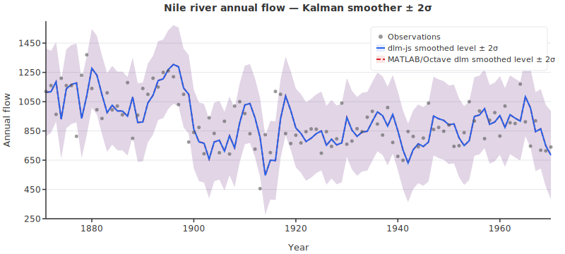
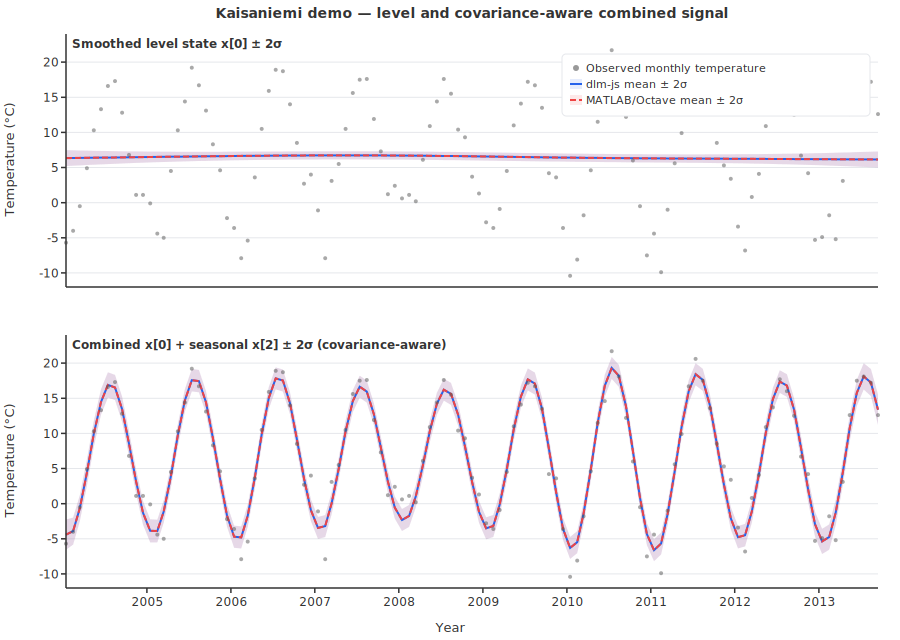

# dlm-js — a minimal jax-js-nonconsuming port of dynamic linear model

<strong>
  <a href="https://hamk-uas.github.io/dlm-js/">API Reference</a> |
  <a href="https://github.com/hamk-uas/dlm-js">GitHub</a> |
  <a href="https://mjlaine.github.io/dlm/">Original DLM Docs</a> |
  <a href="https://github.com/mjlaine/dlm">Original DLM GitHub</a>
</strong>

A minimal [jax-js-nonconsuming](https://github.com/hamk-uas/jax-js-nonconsuming) port of [dynamic linear model](https://mjlaine.github.io/dlm/dlmtut.html) (MATLAB). 



*Nile demo: first smoothed state (level) `x[0]` from dlm-js (solid blue) vs MATLAB/Octave dlm (dashed red), with ± 2σ bands from `xstd[:,0]` (state uncertainty, not observation prediction intervals). Runtime (dlm-js `dlmFit`, jitted core, `wasm` backend, two sequential runs; machine-dependent): first run 62.19 ms, warm run 23.13 ms. Regenerate with `pnpm run gen:svg`.*



*Kaisaniemi seasonal demo (from `mjlaine/dlm` example data): top panel shows level state `x[0] ± 2σ`; bottom panel shows covariance-aware combined signal `x[0]+x[2] ± 2σ`, using `Var(x0+x2)=Var(x0)+Var(x2)+2Cov(x0,x2)`. dlm-js (solid blue) vs MATLAB/Octave (dashed red). Model settings: `order=1`, `trig=1`, `s=2`, `w=[0,0.005,0.4,0.4]`. Runtime (dlm-js `dlmFit`, jitted core, `wasm` backend, two sequential runs; machine-dependent): first run 63.74 ms, warm run 22.95 ms. Regenerate with `pnpm run gen:svg`.*

Timing note: the runtime values above are measured on the `wasm` backend and are machine-dependent.

For background on these demos and the original model formulation, see [Marko Laine's DLM page](https://mjlaine.github.io/dlm/).

## Installation

dlm-js is not yet published to npm. Install directly from GitHub:

```shell
# npm
npm install github:hamk-uas/dlm-js

# pnpm
pnpm add github:hamk-uas/dlm-js
```

This also installs the `@jax-js-nonconsuming/jax` peer dependency automatically.

## Usage

dlm-js works in **both Node.js and the browser** — the library has no platform-specific code. It ships ESM, CommonJS, and TypeScript declarations.

Naming convention: exported JS/TS APIs use camelCase (for example `dlmFit`, `dlmGenSys`), while original MATLAB functions are lowercase (for example `dlmfit`, `dlmsmo`, `dlmgensys`).

### ESM (Node.js / browser bundler)

```js
import { dlmFit, dlmGenSys } from "dlm-js";
import { DType } from "@jax-js-nonconsuming/jax";

// Nile river annual flow data (excerpt)
const y = [1120, 1160, 963, 1210, 1160, 1160, 813, 1230, 1370, 1140];

// Fit a local linear trend model (order=1, state dim m=2)
const result = await dlmFit(y, 120, [40, 10], DType.Float64, { order: 1 });

console.log(result.yhat);  // smoothed predictions
console.log(result.x);     // smoothed states [m][n]
console.log(result.lik);   // -2·log-likelihood
```

### CommonJS (Node.js)

```js
const { dlmFit } = require("dlm-js");
const { DType } = require("@jax-js-nonconsuming/jax");
```

### Generate system matrices only

```js
import { dlmGenSys } from "dlm-js";

const sys = dlmGenSys({ order: 1, trig: 2, ns: 12 });
console.log(sys.G);  // state transition matrix (m×m)
console.log(sys.F);  // observation vector (1×m)
console.log(sys.m);  // state dimension
```

## Features
✅ implemented, ❌ not implemented, — will not be implemented

### Core computation

| Feature | dlm&#8209;js | dlm | Description |
| --- | --- | --- | --- |
| Kalman filter + RTS smoother | ✅ | ✅ | Forward filter and backward smoother for arbitrary state dimension m ≥ 1. |
| Two-pass initialization | ✅ | ✅ | Diffuse prior → smooth → refined initial state, matching MATLAB `dlmfit`. |
| State space generation (`dlmGenSys`) | ✅ | ✅ | Polynomial trend (order 0/1/2), full seasonal, trigonometric seasonal, AR(p) components. |
| Spline mode | ✅ | ✅ | Modified W covariance for order=1 integrated random walk (`options.spline`). |
| Log-likelihood | ✅ | ✅ | -2·log-likelihood via prediction error decomposition (`out.lik`). |
| Diagnostic statistics | ✅ | ✅ | MSE, MAPE, scaled residuals, sum of squares (`out.mse`, `out.mape`, `out.resid2`, `out.ssy`, `out.s2`). |
| float32 computation | ✅ | ❌ | Configurable dtype. Float32 is numerically stable for m ≤ 2; higher dimensions may diverge. GPU/WASM backends available. |
| float64 computation | ✅ | ✅ | Results match MATLAB within ~2e-3 relative tolerance. See [numerical precision notes](#numerical-precision). |
| Device × dtype test matrix | ✅ | — | Tests run on all available (device, dtype) combinations: cpu/f64, cpu/f32, wasm/f64, wasm/f32, webgpu/f32. |
| Synthetic ground-truth tests | ✅ | — | Tests against known true states from a seeded generating process — independent of any reference implementation. |
| Plotting | — | ✅ | dlm-js is computation-only. Plotting is not planned. |

### MATLAB `dlmfit`/`dlmsmo` features not yet ported

| Feature | MATLAB location | Why not yet ported |
| --- | --- | --- |
| Covariates / proxies | `dlmfit` X argument, `dlmsmo` X argument | Straightforward to add (identity block in G, `kron(X(i,:), eye(p))` in F), but no use case has required it yet. |
| Multivariate observations (p > 1) | `dlmsmo` `[p,m] = size(F)` | Biggest remaining lift — affects all matrix dimensions throughout the filter/smoother. dlm-js currently assumes scalar observations (p = 1). |
| Missing data (NaN handling) | `dlmsmo` `ig = not(isnan(y(i,:)))` | Requires masking innovation updates for NaN timesteps. Moderate effort; also needs `meannan`/`sumnan` utility functions. |
| Parameter optimization | `dlmfit` `options.opt` | MATLAB version uses `fminsearch` (Nelder-Mead). No JS optimizer is bundled; would need a third-party dependency or a from-scratch implementation. |
| MCMC parameter estimation | `dlmfit` `options.mcmc` | Depends on Marko Laine's external `mcmcrun` MCMC toolbox, which is not included in the dlm repository. Would require porting or replacing the entire MCMC engine. |
| State sampling (disturbance smoother) | `dlmsmo` `sample` argument | Generates sampled state trajectories for Gibbs sampling. Only useful together with MCMC parameter estimation, so blocked on MCMC. |
| Covariance symmetry enforcement | `dlmsmo` `triu(C) + triu(C,1)'` | MATLAB forces exact matrix symmetry at each step to counteract asymmetric floating-point rounding. dlm-js relies on algebraic symmetry; adding enforcement is low effort but has not been needed. |

## Numerical precision

Since jax-js-nonconsuming v0.2.1, Float64 dot product reductions use Kahan compensated summation, reducing per-dot rounding from O(m·ε) to O(ε²). This improved the seasonal model (m=13) from ~3e-5 to ~1.8e-5 worst-case relative error.

However, the dominant error source is **not** summation accuracy — it is catastrophic cancellation in the RTS backward smoother step `C_smooth = C - C·N·C`. When the smoothing correction nearly equals the prior covariance, the subtraction amplifies any rounding in the operands. Kahan summation cannot fix this because it only improves the individual dot products, not the outer subtraction. See detailed comments in `src/index.ts`.

## TODO

* Test the built library (in `dist/`)
* Implement remaining dlm features (see [unported features table](#matlab-dlmfitdlmsmo-features-not-yet-ported) — covariates, multivariate observations, missing data, parameter estimation)
* Human review the AI-generated DLM port

## Project structure

```text
├── .github/             # GitHub configuration
│   ├── copilot-instructions.md  # AI coding agent instructions
│   └── workflows/           # GitHub Actions CI
│       └── deploy-pages.yaml    # Build and deploy API docs to GitHub Pages
├── assets/              # Generated images (committed to repo)
│   ├── niledemo.svg         # Nile demo plot (regenerate with `pnpm run gen:svg`)
│   └── kaisaniemi.svg       # Kaisaniemi seasonal demo plot (regenerate with `pnpm run gen:svg`)
├── dist/                # Compiled and bundled output (after build)
├── docs/                # Generated API documentation (after `pnpm run docs`, gitignored)
├── issues/              # Drafted GitHub issues for upstream jax-js-nonconsuming
├── scripts/             # SVG plot generators
│   ├── gen-niledemo-svg.ts      # Nile demo SVG generator
│   └── gen-kaisaniemi-svg.ts    # Kaisaniemi seasonal demo SVG generator
├── src/                 # Library TypeScript sources
│   ├── index.ts             # Main source: `dlmSmo` (Kalman+RTS, internal), `dlmFit` (two-pass fitting), `dlmGenSys` export
│   ├── dlmgensys.ts         # State space generator: polynomial, seasonal, AR components
│   └── types.ts             # TypeScript type definitions and helpers
├── tests/               # Test suite
│   ├── octave/              # Octave reference output generators
│   │   ├── dlm/                 # Subset of Marko Laine's MATLAB dlm + mcmcstat (license: `tests/octave/dlm/LICENSE.txt`)
│   │   ├── niledemo.m           # Niledemo — pre-existing MATLAB DLM demo script
│   │   ├── gensys_tests.m       # Additional model tests (synthetic data, generated for this project)
│   │   ├── kaisaniemi_demo.m    # Kaisaniemi seasonal demo reference generator
│   │   └── kaisaniemi.mat       # Kaisaniemi monthly temperature data from mjlaine/dlm examples
│   ├── out/                 # Test outputs (gitignored)
│   ├── test-matrix.ts       # Shared device × dtype test configurations and tolerances
│   ├── niledemo-in.json     # Niledemo input data
│   ├── niledemo-keys.json   # Output keys to compare (for partial implementations)
│   ├── niledemo-out-m.json  # Niledemo reference output from Octave
│   ├── niledemo.test.ts     # Niledemo integration test
│   ├── gensys.test.ts       # dlmGenSys unit tests + multi-model integration tests
│   ├── synthetic.test.ts    # Synthetic ground-truth tests (known true states, statistical assertions)
│   ├── kaisaniemi-{in,out-m}.json    # Kaisaniemi seasonal demo test data
│   ├── {order0,order2,seasonal,trig,level}-{in,out-m}.json  # Test data (see below)
│   └── utils.ts             # Test utility functions
├── tmp/                 # Scratch / temp directory for agents and debug (gitignored)
├── eslint.config.ts     # ESLint configuration (jax-js-nonconsuming memory rules)
├── LICENSE              # License (does not apply to tests/octave/dlm/)
├── package.json         # Node.js package information
├── README.md            # This readme
├── tsconfig.json        # Configuration file of the TypeScript project
├── typedoc.json         # TypeDoc API documentation configuration
└── vite.config.ts       # Configuration file of the Vite project
```

### Included MATLAB sources (`tests/octave/dlm/`)

The `dlm/` directory contains a curated subset of Marko Laine's [dlm](https://mjlaine.github.io/dlm/dlmtut.html) and [mcmcstat](https://mjlaine.github.io/mcmcstat/) MATLAB toolboxes — just enough to run the Kalman filter and RTS smoother without MCMC or optimization dependencies. Licensing for this included subset is documented in [`tests/octave/dlm/LICENSE.txt`](tests/octave/dlm/LICENSE.txt):

| File | Role | Used by our tests? |
| --- | --- | --- |
| `dlmgensys.m` | System matrix generation (G, F) | ✅ Yes — all reference generators |
| `dlmfit.m` | Two-pass fitting entry point | ✅ Yes — called with `options.opt=0`, `options.mcmc=0` (defaults) |
| `dlmsmo.m` | Kalman filter + RTS smoother | ✅ Yes — called by `dlmfit.m` |
| `mvnorrnan.m` | Multivariate normal sampler with singular/zero-variance handling | ✅ Yes — used by `dlmsmo.m` sample path |
| `meannan.m` | Mean ignoring NaNs (from mcmcstat) | ✅ Yes — used by `dlmfit.m` for initial state |
| `sumnan.m` | Sum ignoring NaNs (from mcmcstat) | ✅ Yes — used by `dlmsmo.m` for diagnostics |

**Excluded** (not needed for basic filtering/smoothing): `mcmcrun` (MCMC engine — separate toolbox), `fminsearch`/`optimset` (MATLAB builtins for optimization), `dlmmex` (compiled C acceleration), plotting functions (`dlmplotfit`, `dlmplotdiag`).

### Test data origins

| Test | Source | Description |
| --- | --- | --- |
| `niledemo` | Pre-existing MATLAB DLM demo (`niledemo.m` by Marko Laine) | Annual Nile river flow, order=1 (local linear trend), m=2. Input/reference generated by Octave. |
| `order0` | Generated for this project (`gensys_tests.m`) | Nile data with order=0 (local level), m=1. Tests the simplest model (scalar state). |
| `level` | Generated for this project (`gensys_tests.m`) | First 50 Nile values with order=0, m=1. Compact edge-case test. |
| `order2` | Generated for this project (`gensys_tests.m`) | Synthetic quadratic signal + deterministic "noise" (sin/cos), order=2, m=3. Tests higher polynomial trend. |
| `seasonal` | Generated for this project (`gensys_tests.m`) | Synthetic monthly data (10 years) with trend + 3 harmonics, fullseas=1, ns=12, m=13. Tests full seasonal decomposition. |
| `trig` | Generated for this project (`gensys_tests.m`) | Same synthetic monthly data, trig=2, ns=12, m=6. Tests trigonometric seasonal with fewer states. |
| `kaisaniemi` | `mjlaine/dlm` example data (`kaisaniemi_demo.m`) | Helsinki Kaisaniemi monthly temperatures (117 obs), order=1, trig=1, ns=12, m=4. Tests seasonal cycle with real-world data. |

All generated test data uses deterministic signals (no random noise) so reference outputs are exactly reproducible across platforms.

### Synthetic ground-truth tests

In addition to the Octave reference tests above, `synthetic.test.ts` generates state-space data from a **known generating process** with known true hidden states (using a seeded PRNG with Box-Muller transform for reproducible Gaussian noise). The DLM smoother is then tested against mathematical ground truth rather than another implementation's rounding:

- **Finite outputs**: No NaN/Inf in any result field
- **Positive covariance**: Smoothed covariance diagonals `C[k][k][t] > 0` for all states and timesteps
- **Noise reduction**: Smoother RMSE < observation RMSE (the smoother actually reduces noise)
- **Calibrated uncertainty**: True states fall within the 95% posterior credible intervals at roughly the nominal rate

Models tested: local level (m=1) at moderate/high/low SNR, local linear trend (m=2), trigonometric seasonal (m=6), and full seasonal (m=13). All run across the full device × dtype matrix. Float32 is skipped for m > 2 (see float32 row in the features table).

## Development

### Install Node.js

[Install Node.js](https://nodejs.org/en/download/) to be able to run JavaScript locally. The installation includes the npm package manager.

### Install pnpm globally

This project uses [pnpm](https://pnpm.io/) for fast, disk-efficient dependency management. Install it using npm:

```shell
npm install -g pnpm
```

### Install dependencies using pnpm

Install dlm-js dependencies automatically using pnpm:

```shell
pnpm install
```

### Install Octave

Octave version 10.3.0 is known to work. Other versions will likely work too.

Install Octave and add the folder containing `octave-cli` or `octave-cli.exe` to system path.

### Building and bundling

This project is written in TypeScript. You need to build (compile) it before use:

```shell
pnpm run build
```
This does two things:
  - **Compiles TypeScript (`src/index.ts`) to ESM and CommonJS JavaScript (`dist/dlm-js.es.js`, `dist/dlm-js.cjs.js`) and type definitions (`dist/index.d.ts`).** TypeScript lets you write code with types, but Node.js and browsers only run JavaScript. The build step converts your code to JavaScript.
  - **Bundles the code with Vite for use as a library (outputs ESM and CommonJS formats in `dist/`).** Vite bundles your code so it can be used easily in other projects, in Node.js or browsers, and optimizes it for distribution.

### Generate reference output using Octave

```shell
pnpm run test:octave
```

This generates Octave reference outputs:
- `tests/niledemo-out-m.json` (from `niledemo.m` — pre-existing MATLAB DLM demo)
- `tests/{order0,order2,seasonal,trig,level}-out-m.json` (from `gensys_tests.m` — generated for this project)
- `tests/kaisaniemi-out-m.json` (from `kaisaniemi_demo.m` — Kaisaniemi seasonal demo)

It will also generate test input files unless they already exist.

### Run tests

You can run all tests directly (no build step needed) with:

```shell
pnpm vitest run
```

or

```shell
pnpm run test:node
```

This runs `niledemo.test.ts`, `gensys.test.ts`, and `synthetic.test.ts` against all available device × dtype combinations. Vitest compiles TypeScript on the fly.

To run the full CI-local check (lint + Octave reference generation + tests):

```shell
pnpm run test
```

### Authors
* Marko Laine -- Original DLM and mcmcstat sources in `tests/octave/dlm/` and `tests/octave/niledemo.m`
* Olli Niemitalo (Olli.Niemitalo@hamk.fi) -- Supervision of AI coding agent port of DLM

### Copyright
* 2013-2017 Marko Laine -- Original DLM and mcmcstat sources in `tests/octave/dlm/` and `tests/octave/niledemo.m`
* 2026 HAMK Häme University of Applied Sciences
  
### License
This project is MIT licensed (see [`LICENSE`](LICENSE)).

The included original DLM and mcmcstat MATLAB subset in [`tests/octave/dlm/`](tests/octave/dlm/) is covered by its own license text in [`tests/octave/dlm/LICENSE.txt`](tests/octave/dlm/LICENSE.txt).
