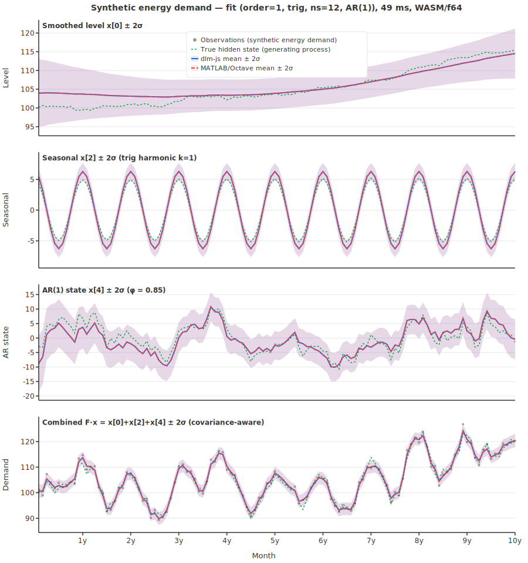
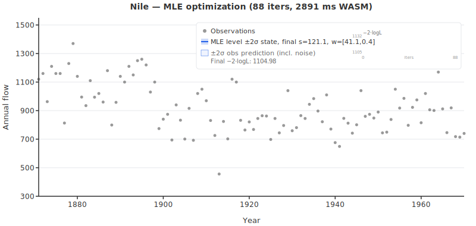
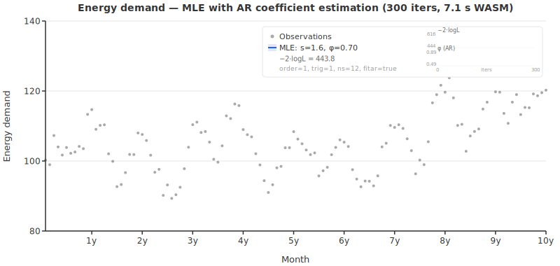
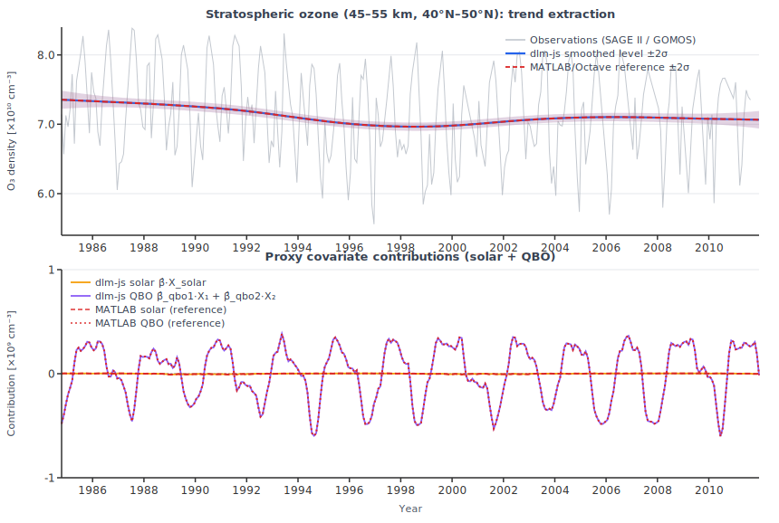

# dlm-js — a minimal jax-js-nonconsuming port of dynamic linear model

<strong>
  <a href="https://hamk-uas.github.io/dlm-js/">API Reference</a> |
  <a href="https://github.com/hamk-uas/dlm-js">GitHub</a> |
  <a href="https://mjlaine.github.io/dlm/">Original DLM Docs</a> |
  <a href="https://github.com/mjlaine/dlm">Original DLM GitHub</a>
</strong>

A minimal [jax-js-nonconsuming](https://github.com/hamk-uas/jax-js-nonconsuming) port of [dynamic linear model](https://mjlaine.github.io/dlm/dlmtut.html) (MATLAB).

🤖 AI generated code & documentation with gentle human supervision.


*Nile demo: first smoothed state (level) `x[0]` from dlm-js (solid blue) vs MATLAB/Octave dlm (dashed red), with ± 2σ bands from `xstd[:,0]` (state uncertainty, not observation prediction intervals). Runtime (dlm-js `dlmFit`, jitted core, `wasm` backend, two sequential runs; machine-dependent): first run 70.41 ms, warm run 27.32 ms. Regenerate with `pnpm run gen:svg`.*


*Kaisaniemi seasonal demo (from `mjlaine/dlm` example data): top panel shows level state `x[0] ± 2σ`; bottom panel shows covariance-aware combined signal `x[0]+x[2] ± 2σ`, using `Var(x0+x2)=Var(x0)+Var(x2)+2Cov(x0,x2)`. dlm-js (solid blue) vs MATLAB/Octave (dashed red). Model settings: `order=1`, `trig=1`, `s=2`, `w=[0,0.005,0.4,0.4]`. Runtime (dlm-js `dlmFit`, jitted core, `wasm` backend, two sequential runs; machine-dependent): first run 70.71 ms, warm run 27.90 ms. Regenerate with `pnpm run gen:svg`.*



*Energy demand demo (synthetic, 10 years monthly): data generated from the DLM state-space model itself with a seeded RNG. Panels top to bottom: smoothed level `x[0] ± 2σ`, trigonometric seasonal `x[2] ± 2σ`, AR(1) state `x[4] ± 2σ`, and covariance-aware combined signal `F·x = x[0]+x[2]+x[4] ± 2σ`. True hidden states from the generating process (green dashed) are overlaid, showing how well the RTS smoother recovers the ground truth. dlm-js (solid blue) vs MATLAB/Octave (dashed red). Model settings: `order=1`, `trig=1`, `ns=12`, `arphi=[0.85]`, `s=1.5`, `w=[0.3,0.02,0.02,0.02,2.5]`, m=5. Runtime (dlm-js `dlmFit`, jitted core, `wasm` backend, two sequential runs; machine-dependent): first run 69.62 ms, warm run 27.13 ms. Regenerate with `pnpm run gen:svg`.*



*Nile MLE demo: parameter estimation via autodiff (`dlmMLE`). Orange dashed = initial variance-based guess, blue solid = MLE optimum. The entire optimization step — `valueAndGrad` (Kalman filter forward + AD backward) and Adam parameter update — is wrapped in a single `jit()` call. Converged in 88 iterations / 2891 ms on the `wasm` backend (Adam b2=0.9). Estimated observation noise s = 121.1 (known: 122.9), -2·log-likelihood = 1105.0. Regenerate with `pnpm run gen:svg`.*



*Energy MLE demo with AR coefficient estimation: joint estimation of observation noise s, state variances w, and AR(1) coefficient φ via autodiff (`dlmMLE` with `fitar: true`). Shows the combined signal F·x ± 2σ converging from a variance-based initial guess (orange dashed) to the MLE optimum (blue solid). Two sparklines track convergence: −2·log-likelihood (amber) and AR coefficient φ (green, 0.52 → 0.68, true: 0.85). Model: `order=1`, `trig=1`, `ns=12`, m=5. 295 iterations / 6.9 s on the `wasm` backend (Adam b2=0.9). Regenerate with `pnpm run gen:svg`.*



*Stratospheric ozone demo (Laine, Latva-Pukkila & Kyrölä (2014), [ACP 14, 9707–9725](https://doi.org/10.5194/acp-14-9707-2014), replication via `dlmFit`): top panel shows O₃ density (SAGE II / GOMOS observations, 1984–2011; data file from [mjlaine/dlm](https://github.com/mjlaine/dlm/tree/master/examples)) with the smoothed level state ± 2σ (dlm-js solid blue, MATLAB/Octave dashed red) and a 15-year (180-month) `dlmForecast` trend extrapolation beyond the last observation (dashed green, ± 2σ level-state uncertainty, shaded region — the level state x[0] is plotted rather than the full observation prediction, which would oscillate with the seasonal harmonics); bottom panel shows proxy covariate contributions — solar cycle (β̂·X_solar, amber) and QBO (β̂_qbo1·X₁ + β̂_qbo2·X₂, purple). Model: `order=1`, `trig=2`, `ns=12`, 3 static-β covariates, state dimension m=9. Forecast interpretation note: this is a conditional forecast under the chosen future proxy path assumptions (unknown future proxies are not inferred by the model). Regenerate with `pnpm run gen:svg`.*

Timing note: the runtime values above are measured on the `wasm` backend and are machine-dependent.

For background on the Nile and Kaisaniemi demos and the original model formulation, see [Marko Laine's DLM page](https://mjlaine.github.io/dlm/). The energy demand demo uses synthetic data generated for this project. The Nile MLE demo estimates `s` and `w` on the classic Nile dataset; the energy MLE demo jointly estimates `s`, `w`, and AR coefficient `φ` on the synthetic energy model (`fitar: true`). See the [MLE comparison](https://github.com/hamk-uas/dlm-js/blob/main/mle-comparison.md) for details.

## Installation

dlm-js is not yet published to npm. Install directly from GitHub:

```shell
# npm
npm install github:hamk-uas/dlm-js

# pnpm
pnpm add github:hamk-uas/dlm-js
```

This also installs the `@hamk-uas/jax-js-nonconsuming` dependency automatically.

## Usage

dlm-js works in **both Node.js and the browser** — the library has no platform-specific code. It ships ESM, CommonJS, and TypeScript declarations.

Naming convention: exported JS/TS APIs use camelCase (for example `dlmFit`, `dlmGenSys`), while original MATLAB functions are lowercase (for example `dlmfit`, `dlmsmo`, `dlmgensys`).

### ESM (Node.js / browser bundler)

```js
import { dlmFit, dlmGenSys } from "dlm-js";
import { DType } from "@hamk-uas/jax-js-nonconsuming";

// Nile river annual flow data (excerpt)
const y = [1120, 1160, 963, 1210, 1160, 1160, 813, 1230, 1370, 1140];

// Fit a local linear trend model (order=1, state dim m=2)
const result = await dlmFit(y, 120, [40, 10], DType.Float64, { order: 1 });

console.log(result.yhat);  // smoothed predictions
console.log(result.x);     // smoothed states [m][n]
console.log(result.lik);   // -2·log-likelihood
```

### CommonJS (Node.js)

```js
const { dlmFit } = require("dlm-js");
const { DType } = require("@hamk-uas/jax-js-nonconsuming");
```

### Generate system matrices only

```js
import { dlmGenSys } from "dlm-js";

const sys = dlmGenSys({ order: 1, trig: 2, ns: 12 });
console.log(sys.G);  // state transition matrix (m×m)
console.log(sys.F);  // observation vector (1×m)
console.log(sys.m);  // state dimension
```

### MLE parameter estimation

Estimate observation noise `s`, state noise `w`, and optionally AR coefficients by maximizing the Kalman filter log-likelihood via autodiff:

```js
import { dlmMLE } from "dlm-js";
import { DType, defaultDevice } from "@hamk-uas/jax-js-nonconsuming";

defaultDevice("wasm"); // recommended: ~30× faster than "cpu"

const y = [1120, 1160, 963, 1210, 1160, 1160, 813, 1230, 1370, 1140 /* ... */];

// Basic: estimate s and w
const mle = await dlmMLE(
  y,
  { order: 1 },           // model: local linear trend (m=2)
  undefined,              // auto initial guess from data variance
  300,                    // max iterations
  0.05,                   // Adam learning rate
  1e-6,                   // convergence tolerance
  DType.Float64,
);

console.log(mle.s);           // estimated observation noise std dev
console.log(mle.w);           // estimated state noise std devs
console.log(mle.lik);         // -2·log-likelihood at optimum
console.log(mle.iterations);  // iterations to convergence
console.log(mle.elapsed);     // wall-clock ms
console.log(mle.fit);         // full DlmFitResult with optimized parameters

// With AR fitting: estimate s, w, and AR coefficients jointly
const mleAR = await dlmMLE(
  y,
  { order: 0, arphi: [0.5], fitar: true },  // initial arphi + fitar flag
  undefined,
  300, 0.02, 1e-6, DType.Float64,
);
console.log(mleAR.arphi);     // estimated AR coefficients (e.g. [0.81])
```

The entire optimization step is wrapped in a single `jit()` call: `valueAndGrad(loss)` (Kalman filter forward pass + AD backward pass) and optax Adam parameter update. The Kalman filter inside the loss function uses `lax.scan` for autodiff compatibility. Noise parameters are unconstrained via log-space: `s = exp(θ_s)`, `w[i] = exp(θ_{w,i})`. AR coefficients are optimized directly (unconstrained, not log-transformed — matching MATLAB DLM behavior).

**Performance**: on the `wasm` backend, one Nile MLE run (100 observations, m = 2) converges in ~88 iterations (~2.7 s) with the default Adam b2=0.9. The `jit()` compilation happens on the first iteration; subsequent iterations run from compiled code.

For a detailed comparison of dlm-js MLE vs the original MATLAB DLM parameter estimation (Nelder-Mead, MCMC), see the [MLE comparison](https://github.com/hamk-uas/dlm-js/blob/main/mle-comparison.md).

### h-step-ahead forecasting

Propagate the last smoothed state h steps forward with no new observations:

```js
import { dlmFit, dlmForecast } from "dlm-js";
import { DType } from "@hamk-uas/jax-js-nonconsuming";

const y = [1120, 1160, 963, 1210, 1160, 1160, 813, 1230, 1370, 1140];

// Fit a local linear trend model
const fit = await dlmFit(y, 120, [40, 10], DType.Float64, { order: 1 });

// Forecast 12 steps ahead
const fc = await dlmForecast(fit, 120, 12, DType.Float64);

console.log(fc.yhat);  // predicted observation means [h] = F·x_pred
console.log(fc.ystd);  // observation prediction std devs [h] — grows monotonically
console.log(fc.x);     // state trajectories [m][h]
console.log(fc.h);     // 12
console.log(fc.m);     // 2 (state dimension)
```

`fc.yhat` is the full observation prediction `F·x_pred`. For pure trend models (no seasonality) this equals the level state and is appropriate to plot directly. For seasonal or AR models, `yhat` oscillates with the harmonics/AR dynamics in the forecast horizon — if you want a smooth trendline, use the level state `fc.x[0]` directly:

```js
// For seasonal/AR models: plot level state, not yhat
const trend = Array.from(fc.x[0]);        // smooth trend mean
const trendStd = fc.xstd.map(r => r[0]);  // level state std dev
```

With covariates, pass `X_forecast` rows for each forecast step:

```js
// Forecast 3 steps ahead with known future covariate values
const fc = await dlmForecast(fit, 120, 3, DType.Float64, [
  [solarProxy[n], qbo1[n], qbo2[n]],    // step n+1
  [solarProxy[n+1], qbo1[n+1], qbo2[n+1]], // step n+2
  [solarProxy[n+2], qbo1[n+2], qbo2[n+2]], // step n+3
]);
```

Current behavior for unknown future covariates: if `X_forecast` is omitted (or does not provide a row/entry), dlm-js uses `0` for the missing covariate value in that step. Interpret this as a **baseline conditional forecast** (unknown driver effects set to zero), not a full unconditional forecast.

For a more neutral assumption in practice, center covariates before fitting so that `0` represents a typical/historical-average driver level. Then the default forecast corresponds to “no expected driver anomaly.”

For decision use, prefer scenario forecasting: provide multiple plausible `X_forecast` paths (e.g. low/base/high) and compare resulting forecast bands.

## Features
✅ implemented, ❌ not implemented, — will not be implemented

### Core computation

| Feature | dlm&#8209;js | dlm | Description |
| --- | --- | --- | --- |
| Kalman filter + RTS smoother | ✅ | ✅ | Forward filter and backward smoother for arbitrary state dimension m ≥ 1. |
| Two-pass initialization | ✅ | ✅ | Diffuse prior → smooth → refined initial state, matching MATLAB `dlmfit`. |
| State space generation (`dlmGenSys`) | ✅ | ✅ | Polynomial trend (order 0/1/2), full seasonal, trigonometric seasonal, AR(p) components. |
| Spline mode | ✅ | ✅ | Modified W covariance for order=1 integrated random walk (`options.spline`). |
| Log-likelihood | ✅ | ✅ | -2·log-likelihood via prediction error decomposition (`out.lik`). |
| Diagnostic statistics | ✅ | ✅ | MSE, MAPE, scaled residuals, sum of squares (`out.mse`, `out.mape`, `out.resid2`, `out.ssy`, `out.s2`). |
| MLE parameter estimation | ✅ | ✅ | `dlmMLE`: estimate observation noise `s`, state noise `w`, and optionally AR coefficients (`fitar: true`) by maximizing the Kalman filter log-likelihood via autodiff (`valueAndGrad` + `lax.scan`). optax Adam optimizer, fully `jit()`-compiled. |
| h-step-ahead forecasting | ✅ | ❌ | `dlmForecast`: propagate the last smoothed state h steps forward with no new observations. Returns `yhat` [h], `ystd` [h] (growing uncertainty), and full state+covariance trajectories. Supports all model types and covariates. |
| float32 computation | ✅ | ❌ | Configurable dtype. Float32 is numerically stable for m ≤ 2; higher dimensions may diverge. GPU/WASM backends available. |
| float64 computation | ✅ | ✅ | Results match MATLAB within ~2e-3 relative tolerance. See [numerical precision notes](#numerical-precision). |
| Device × dtype test matrix | ✅ | — | Tests run on all available (device, dtype) combinations: cpu/f64, cpu/f32, wasm/f64, wasm/f32, webgpu/f32. |
| Synthetic ground-truth tests | ✅ | — | Tests against known true states from a seeded generating process — independent of any reference implementation. |
| Covariates / proxies (X) | ✅ | ✅ | `dlmFit` X parameter: per-timestep regression matrix X[t] appends static β states to the state vector. Coefficient recovery verified in `covariate.test.ts`. |
| Plotting | — | ✅ | dlm-js is computation-only. Plotting is not planned. |

### MATLAB `dlmfit`/`dlmsmo` features not yet ported

| Feature | MATLAB location | Why not yet ported |
| --- | --- | --- |
| ~~Covariates / proxies~~ | `dlmfit` X argument, `dlmsmo` X argument | ✅ **Ported** as `dlmFit` X parameter — appends static β states; tested in `covariate.test.ts`. |
| Multivariate observations (p > 1) | `dlmsmo` `[p,m] = size(F)` | Biggest remaining lift — affects all matrix dimensions throughout the filter/smoother. dlm-js currently assumes scalar observations (p = 1). |
| Missing data (NaN handling) | `dlmsmo` `ig = not(isnan(y(i,:)))` | Requires masking innovation updates for NaN timesteps. Moderate effort; also needs `meannan`/`sumnan` utility functions. |
| ~~Parameter optimization~~ | `dlmfit` `options.opt` | ✅ **Ported** as `dlmMLE` — uses autodiff (gradient-based) instead of Nelder-Mead. Supports `fitar` for AR coefficient estimation. See [MLE estimation](#mle-parameter-estimation) below. |
| MCMC parameter estimation | `dlmfit` `options.mcmc` | Depends on Marko Laine's external `mcmcrun` MCMC toolbox, which is not included in the dlm repository. Would require porting or replacing the entire MCMC engine. |
| State sampling (disturbance smoother) | `dlmsmo` `sample` argument | Generates sampled state trajectories for Gibbs sampling. Only useful together with MCMC parameter estimation, so blocked on MCMC. |
| Covariance symmetry enforcement | `dlmsmo` `triu(C) + triu(C,1)'` | MATLAB forces exact matrix symmetry at each step to counteract asymmetric floating-point rounding. dlm-js relies on algebraic symmetry; adding enforcement is low effort but has not been needed. |

## Numerical precision

Since jax-js-nonconsuming v0.2.1, Float64 dot product reductions use Kahan compensated summation, reducing per-dot rounding from O(m·ε) to O(ε²). This improved the seasonal model (m=13) from ~3e-5 to ~1.8e-5 worst-case relative error.

However, the dominant error source is **not** summation accuracy — it is catastrophic cancellation in the RTS backward smoother step `C_smooth = C - C·N·C`. When the smoothing correction nearly equals the prior covariance, the subtraction amplifies any rounding in the operands. Kahan summation cannot fix this because it only improves the individual dot products, not the outer subtraction. See detailed comments in `src/index.ts`.

## TODO

* Test the built library (in `dist/`)
* Implement remaining dlm features (see [unported features table](#matlab-dlmfitdlmsmo-features-not-yet-ported) — multivariate observations, missing data)
* Human review the AI-generated DLM port

## Project structure

```text
├── .github/             # GitHub configuration
│   ├── copilot-instructions.md  # AI coding agent instructions
│   └── workflows/           # GitHub Actions CI
│       └── deploy-pages.yaml    # Build and deploy API docs to GitHub Pages
├── assets/              # Generated images (committed to repo)
│   ├── niledemo.svg         # Nile demo plot (regenerate with `pnpm run gen:svg`)
│   ├── kaisaniemi.svg       # Kaisaniemi seasonal demo plot (regenerate with `pnpm run gen:svg`)
│   ├── trigar.svg           # Energy demand demo plot (regenerate with `pnpm run gen:svg`)
│   ├── nile-mle-anim.svg    # Nile MLE optimization animation (regenerate with `pnpm run gen:svg`)
│   ├── energy-mle-anim.svg  # Energy MLE animation with AR coefficient estimation (regenerate with `pnpm run gen:svg`)
│   └── ozone-demo.svg       # Stratospheric ozone trend analysis demo (regenerate with `pnpm run gen:svg`)
├── dist/                # Compiled and bundled output (after build)
├── docs/                # Generated API documentation (after `pnpm run docs`, gitignored)
├── issues/              # Drafted GitHub issues for upstream jax-js-nonconsuming
├── scripts/             # SVG plot generators and frame collectors
│   ├── gen-niledemo-svg.ts          # Nile demo SVG generator
│   ├── gen-kaisaniemi-svg.ts        # Kaisaniemi seasonal demo SVG generator
│   ├── gen-trigar-svg.ts            # Energy demand demo SVG generator
│   ├── gen-nile-mle-svg.ts         # Nile MLE before/after optimization SVG generator
│   ├── collect-nile-mle-frames.ts   # Nile MLE frame data collector (→ tmp/mle-frames.json)
│   ├── gen-nile-mle-anim-svg.ts    # Nile MLE animated convergence SVG generator
│   ├── collect-energy-mle-frames.ts # Energy MLE frame data collector (→ tmp/energy-mle-frames.json)
│   ├── gen-energy-mle-anim-svg.ts  # Energy MLE animation SVG generator (with AR coefficient estimation)
│   └── gen-ozone-svg.ts             # Stratospheric ozone trend analysis SVG generator
├── src/                 # Library TypeScript sources
│   ├── index.ts             # Main source: `dlmSmo` (Kalman+RTS, internal), `dlmFit` (two-pass fitting), `dlmForecast` (h-step-ahead forecast), `dlmGenSys` export
│   ├── dlmgensys.ts         # State space generator: polynomial, seasonal, AR components
│   ├── mle.ts               # `dlmMLE`: MLE parameter estimation via autodiff (valueAndGrad + lax.scan + optax Adam)
│   └── types.ts             # TypeScript type definitions and helpers
├── tests/               # Test suite
│   ├── octave/              # Octave reference output generators
│   │   ├── dlm/                 # Subset of Marko Laine's MATLAB dlm + mcmcstat (license: `tests/octave/dlm/LICENSE.txt`)
│   │   ├── niledemo.m           # Niledemo — pre-existing MATLAB DLM demo script
│   │   ├── gensys_tests.m       # Additional model tests (synthetic data, generated for this project)
│   │   ├── kaisaniemi_demo.m    # Kaisaniemi seasonal demo reference generator
│   │   └── kaisaniemi.mat       # Kaisaniemi monthly temperature data from mjlaine/dlm examples
│   ├── out/                 # Test outputs (gitignored)
│   ├── test-matrix.ts       # Shared device × dtype test configurations and tolerances
│   ├── niledemo-in.json     # Niledemo input data
│   ├── niledemo-keys.json   # Output keys to compare (for partial implementations)
│   ├── niledemo-out-m.json  # Niledemo reference output from Octave
│   ├── niledemo.test.ts     # Niledemo integration test
│   ├── gensys.test.ts       # dlmGenSys unit tests + multi-model integration tests
│   ├── synthetic.test.ts    # Synthetic ground-truth tests (known true states, statistical assertions)
│   ├── kaisaniemi-{in,out-m}.json    # Kaisaniemi seasonal demo test data
│   ├── {order0,order2,seasonal,trig,trigar,level,energy,ar2}-{in,out-m}.json  # Test data (see below)
│   ├── mle.test.ts          # MLE parameter estimation tests (s/w and AR coefficient estimation on WASM)
│   ├── covariate.test.ts    # Covariate (X parameter) regression tests — β recovery and XX field
│   ├── ozone.test.ts        # Ozone demo smoke tests — dlmFit with covariates on real satellite data
│   ├── forecast.test.ts     # dlmForecast tests — h-step predictions, monotone ystd, covariate support
│   └── utils.ts             # Test utility functions
├── mle-comparison.md    # Comparison of dlm-js MLE vs original MATLAB DLM parameter estimation
├── tmp/                 # Scratch / temp directory for agents and debug (gitignored)
├── eslint.config.ts     # ESLint configuration (jax-js-nonconsuming memory rules)
├── LICENSE              # License (does not apply to tests/octave/dlm/)
├── package.json         # Node.js package information
├── README.md            # This readme
├── tsconfig.json        # Configuration file of the TypeScript project
├── typedoc.json         # TypeDoc API documentation configuration
└── vite.config.ts       # Configuration file of the Vite project
```

### Included MATLAB sources (`tests/octave/dlm/`)

The `dlm/` directory contains a curated subset of Marko Laine's [dlm](https://mjlaine.github.io/dlm/dlmtut.html) and [mcmcstat](https://mjlaine.github.io/mcmcstat/) MATLAB toolboxes — just enough to run the Kalman filter and RTS smoother without MCMC or optimization dependencies. Licensing for this included subset is documented in [`tests/octave/dlm/LICENSE.txt`](tests/octave/dlm/LICENSE.txt):

| File | Role | Used by our tests? |
| --- | --- | --- |
| `dlmgensys.m` | System matrix generation (G, F) | ✅ Yes — all reference generators |
| `dlmfit.m` | Two-pass fitting entry point | ✅ Yes — called with `options.opt=0`, `options.mcmc=0` (defaults) |
| `dlmsmo.m` | Kalman filter + RTS smoother | ✅ Yes — called by `dlmfit.m` |
| `mvnorrnan.m` | Multivariate normal sampler with singular/zero-variance handling | ✅ Yes — used by `dlmsmo.m` sample path |
| `meannan.m` | Mean ignoring NaNs (from mcmcstat) | ✅ Yes — used by `dlmfit.m` for initial state |
| `sumnan.m` | Sum ignoring NaNs (from mcmcstat) | ✅ Yes — used by `dlmsmo.m` for diagnostics |

**Excluded** (not needed for basic filtering/smoothing): `mcmcrun` (MCMC engine — separate toolbox), `fminsearch`/`optimset` (MATLAB builtins for optimization), `dlmmex` (compiled C acceleration), plotting functions (`dlmplotfit`, `dlmplotdiag`).

### Test data origins

| Test | Source | Description |
| --- | --- | --- |
| `niledemo` | Pre-existing MATLAB DLM demo (`niledemo.m` by Marko Laine) | Annual Nile river flow, order=1 (local linear trend), m=2. Input/reference generated by Octave. |
| `order0` | Generated for this project (`gensys_tests.m`) | Nile data with order=0 (local level), m=1. Tests the simplest model (scalar state). |
| `level` | Generated for this project (`gensys_tests.m`) | First 50 Nile values with order=0, m=1. Compact edge-case test. |
| `order2` | Generated for this project (`gensys_tests.m`) | Synthetic quadratic signal + deterministic "noise" (sin/cos), order=2, m=3. Tests higher polynomial trend. |
| `seasonal` | Generated for this project (`gensys_tests.m`) | Synthetic monthly data (10 years) with trend + 3 harmonics, fullseas=1, ns=12, m=13. Tests full seasonal decomposition. |
| `trig` | Generated for this project (`gensys_tests.m`) | Same synthetic monthly data, trig=2, ns=12, m=6. Tests trigonometric seasonal with fewer states. |
| `kaisaniemi` | `mjlaine/dlm` example data (`kaisaniemi_demo.m`) | Helsinki Kaisaniemi monthly temperatures (117 obs), order=1, trig=1, ns=12, m=4. Tests seasonal cycle with real-world data. |
| `trigar` | Generated for this project (`gensys_tests.m`) | Same synthetic monthly data, trig=1, ns=12, arphi=[0.7], m=5. Tests trigonometric seasonal combined with autoregression. |
| `energy` | Generated for this project (`gensys_tests.m`) | Synthetic energy demand (120 obs, seeded RNG), trig=1, ns=12, arphi=[0.85], m=5. Data generated from the DLM model itself — tests recovery of AR dynamics alongside trend and seasonal. |
| `ar2` | Generated for this project (`gensys_tests.m`) | Synthetic data (100 obs, seeded RNG), arphi=[0.6, -0.3], m=4. AR(2) with damped oscillatory roots — tests higher-order autoregression without seasonal. |

Most generated test data uses deterministic signals (no random noise). The `energy` and `ar2` tests use seeded random noise (`rng(42,'twister')` and `rng(99,'twister')` in Octave) so they are still exactly reproducible across platforms.

### Synthetic ground-truth tests

In addition to the Octave reference tests above, `synthetic.test.ts` generates state-space data from a **known generating process** with known true hidden states (using a seeded PRNG with Box-Muller transform for reproducible Gaussian noise). The DLM smoother is then tested against mathematical ground truth rather than another implementation's rounding:

- **Finite outputs**: No NaN/Inf in any result field
- **Positive covariance**: Smoothed covariance diagonals `C[k][k][t] > 0` for all states and timesteps
- **Noise reduction**: Smoother RMSE < observation RMSE (the smoother actually reduces noise)
- **Calibrated uncertainty**: True states fall within the 95% posterior credible intervals at roughly the nominal rate

Models tested: local level (m=1) at moderate/high/low SNR, local linear trend (m=2), trigonometric seasonal (m=6), and full seasonal (m=13). All run across the full device × dtype matrix. Float32 is skipped for m > 2 (see float32 row in the features table).

## Development

### Install Node.js

[Install Node.js](https://nodejs.org/en/download/) to be able to run JavaScript locally. The installation includes the npm package manager.

### Install pnpm globally

This project uses [pnpm](https://pnpm.io/) for fast, disk-efficient dependency management. Install it using npm:

```shell
npm install -g pnpm
```

### Install dependencies using pnpm

Install dlm-js dependencies automatically using pnpm:

```shell
pnpm install
```

### Install Octave

Octave version 10.3.0 is known to work. Other versions will likely work too.

Install Octave and add the folder containing `octave-cli` or `octave-cli.exe` to system path.

### Building and bundling

This project is written in TypeScript. You need to build (compile) it before use:

```shell
pnpm run build
```
This does two things:
  - **Compiles TypeScript (`src/index.ts`) to ESM and CommonJS JavaScript (`dist/dlm-js.es.js`, `dist/dlm-js.cjs.js`) and type definitions (`dist/index.d.ts`).** TypeScript lets you write code with types, but Node.js and browsers only run JavaScript. The build step converts your code to JavaScript.
  - **Bundles the code with Vite for use as a library (outputs ESM and CommonJS formats in `dist/`).** Vite bundles your code so it can be used easily in other projects, in Node.js or browsers, and optimizes it for distribution.

### Generate reference output using Octave

```shell
pnpm run test:octave
```

This generates Octave reference outputs:
- `tests/niledemo-out-m.json` (from `niledemo.m` — pre-existing MATLAB DLM demo)
- `tests/{order0,order2,seasonal,trig,trigar,level,energy,ar2}-out-m.json` (from `gensys_tests.m` — generated for this project)
- `tests/kaisaniemi-out-m.json` (from `kaisaniemi_demo.m` — Kaisaniemi seasonal demo)

It will also generate test input files unless they already exist.

### Run tests

You can run all tests directly (no build step needed) with:

```shell
pnpm vitest run
```

or

```shell
pnpm run test:node
```

This runs `niledemo.test.ts`, `gensys.test.ts`, `synthetic.test.ts`, `mle.test.ts`, `covariate.test.ts`, and `ozone.test.ts` against all available device × dtype combinations. Vitest compiles TypeScript on the fly.

To run the full CI-local check (lint + Octave reference generation + tests):

```shell
pnpm run test
```

### Authors
* Marko Laine -- Original DLM and mcmcstat sources in `tests/octave/dlm/` and `tests/octave/niledemo.m`
* Olli Niemitalo (Olli.Niemitalo@hamk.fi) -- Supervision of AI coding agent port of DLM

### Copyright
* 2013-2017 Marko Laine -- Original DLM and mcmcstat sources in `tests/octave/dlm/` and `tests/octave/niledemo.m`
* 2026 HAMK Häme University of Applied Sciences
  
### License
This project is MIT licensed (see [`LICENSE`](LICENSE)).

The included original DLM and mcmcstat MATLAB subset in [`tests/octave/dlm/`](tests/octave/dlm/) is covered by its own license text in [`tests/octave/dlm/LICENSE.txt`](tests/octave/dlm/LICENSE.txt).
